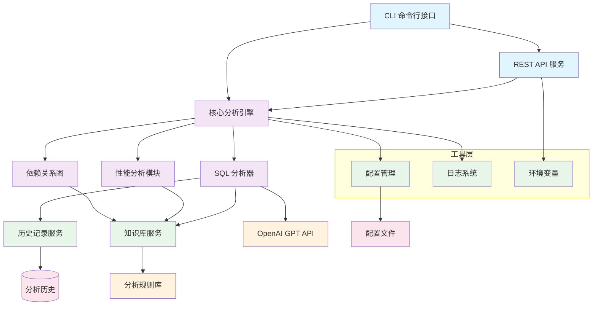

<div align="center">

# SQL Analyzer CLI

一个基于 AI 的 SQL 语句智能分析与扫描命令行工具
支持性能优化、安全检查和编码规范验证。

[功能特点](#功能特点) • [安装](#安装) • [快速开始](#快速开始) • [文档](#文档) 

</div>

## 功能特点

- 🤖 **AI 驱动分析**：基于 OpenAI GPT 模型进行智能 SQL 分析
- 🔍 **多维度检查**：性能、安全、编码规范全方位分析
- 📊 **详细报告**：提供清晰的问题描述和优化建议
- 📚 **知识库支持**：内置 SQL 最佳实践知识库
- 🌐 **API 服务**：提供 REST API  接口
- 📝 **历史记录**：保存分析历史，便于追踪和比较
- ⚙️ **灵活配置**：支持多种数据库和自定义规则

## 安装

### 使用 Bun 安装

```bash
bun install -g sql-analyzer-cli
```

### 本地安装

```bash
git clone https://github.com/yourusername/sql-analyzer-cli.git
cd sql-analyzer-cli
bun install
bun link
```

## 快速开始

### 1. 配置 API 密钥

```bash
编辑.env文件
## 或者
sql-analyzer config
```

### 2. 分析 SQL 语句

```bash
sql-analyzer analyze -s "SELECT * FROM users WHERE id = 1"
```

### 3. 分析 SQL 文件

```bash
sql-analyzer analyze -f ./examples/mysql_examples.sql
```

## 文档

我们提供了详细的文档来帮助你快速上手和深入了解项目：

- 📖 [完整文档](./docs/README.md) - 查看所有文档
- 🚀 [安装指南](./docs/installation.md) - 详细的安装和配置说明
- 📋 [使用指南](./docs/usage.md) - 所有命令和选项的详细说明
- ⚙️ [配置指南](./docs/configuration.md) - 如何自定义和优化配置
- 🔌 [API 文档](./docs/api.md) - REST API 和 WebSocket 接口文档


## 项目结构

```
sql-analyzer-cli/
├── bin/                # 可执行文件
├── src/                # 源代码
│   ├── core/           # 核心功能
│   ├── services/       # 服务层
│   └── utils/          # 工具函数
├── docs/               # 文档
├── examples/           # 示例文件
├── rules/              # 分析规则
└── config/             # 配置文件
```

## 项目架构



### 架构说明

- **用户接口层**：提供CLI命令行和REST API两种交互方式
- **核心分析引擎**：负责协调各分析模块，处理SQL分析请求
- **分析模块**：
  - SQL分析器：执行基本的SQL语法和结构分析
  - 性能分析模块：专门处理性能相关问题
  - 依赖关系图：分析表之间的依赖关系
- **服务层**：提供知识库查询、历史记录等辅助服务
- **工具层**：提供配置管理、日志记录等基础功能
- **外部依赖**：OpenAI API和规则库提供分析能力支持


## 联系我们

- 📧 邮箱：sewardsheng@gmail.com
- 🐛 问题反馈：[GitHub Issues](https://github.com/sewardsheng/sql-analyzer-cli/issues)
- 💬 讨论：[GitHub Discussions](https://github.com/sewardsheng/sql-analyzer-cli/discussions)

---

<div align="center">

**[⬆ 回到顶部](#sql-analyzer-cli)**

Made with ❤️ by SQL Analyzer CLI Team

</div>