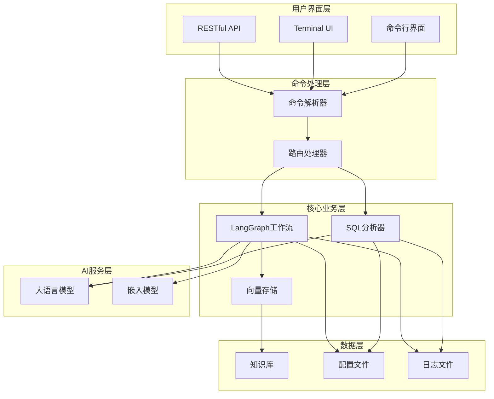
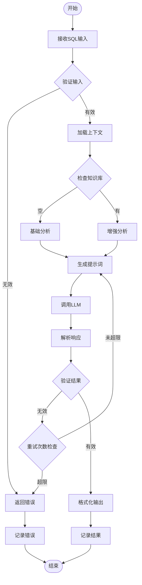

# SQL分析器CLI工具

一个基于LangChain和Bun的SQL语句智能分析与扫描命令行工具，能够从性能、安全性和规范性等多个维度分析SQL语句，并提供优化建议。

## 功能特点

- 🔍 **多维度分析**：从性能、安全性和规范性三个维度分析SQL语句
- 🗄️ **多数据库支持**：支持MySQL、PostgreSQL、Oracle、SQL Server等主流数据库
- 🤖 **AI驱动**：基于LangChain和OpenAI GPT模型进行智能分析
- 📚 **知识库增强**：支持加载自定义规则文档，使分析结果更加精准
- 📊 **结构化输出**：提供清晰的分析结果和优化建议
- 🖥️ **Terminal UI**：提供直观的菜单界面，通过数字选择功能
- ⚙️ **灵活配置**：支持多种配置方式和自定义选项
- 🌐 **API服务**：提供RESTful API接口，支持HTTP请求进行SQL分析
- 📝 **历史记录**：自动保存分析历史，支持查看、删除和管理历史记录
- ⚡ **高性能**：基于Bun运行时和Hono框架，提供更快的执行速度和更低的资源消耗

## 系统架构



## LangGraph工作流



## 目录

- [安装](#安装)
- [快速开始](#快速开始)
- [命令详解](#命令详解)
- [历史记录管理](#历史记录管理)
- [API服务](#api服务)
- [配置系统](#配置系统)
- [知识库功能](#知识库功能)
- [输出示例](#输出示例)
- [示例](#示例)
- [故障排除](#故障排除)
- [测试](#测试)
- [开发](#开发)
- [更新日志](#更新日志)
- [贡献指南](#贡献指南)
- [许可证](#许可证)
- [联系方式](#联系方式)

## 安装

### 从源码安装

```bash
git clone https://github.com/sewardsheng/sql-analyzer-cli.git
cd sql-analyzer-cli
bun install
bun link
```

## 快速开始

### 1. 初始化配置

```bash
sql-analyzer init
```

这将创建一个`.env`文件，请编辑该文件并填入你的API密钥：

```env
CUSTOM_API_KEY=your_api_key_here
CUSTOM_BASE_URL=https://api.openai.com/v1
CUSTOM_MODEL=gpt-3.5-turbo
DEFAULT_DATABASE_TYPE=mysql
```

### 2. 配置API密钥（可选）

你也可以使用交互式配置命令，它将直接更新项目目录中的`.env`文件：

```bash
sql-analyzer config
```

该命令将引导你完成以下配置项：
- API密钥 (CUSTOM_API_KEY)
- API基础URL (CUSTOM_BASE_URL)
- 模型名称 (CUSTOM_MODEL)
- 默认数据库类型 (DEFAULT_DATABASE_TYPE)
- 嵌入模型名称 (CUSTOM_EMBEDDING_MODEL)

### 3. 加载知识库（可选但推荐）

```bash
# 使用默认rules目录
sql-analyzer learn

# 指定自定义rules目录
sql-analyzer learn --rules-dir /path/to/your/rules
```

### 4. 使用SQL分析器

#### 启动Terminal UI模式（推荐）

```bash
# 启动Terminal UI模式
sql-analyzer ui
```

Terminal UI模式提供了一个直观的菜单界面，您可以通过输入数字或使用方向键选择对应功能：

1. **分析SQL语句** - 分析单个SQL语句或从文件读取SQL
2. **批量分析SQL语句** - 从文件批量分析多个SQL语句
3. **历史记录管理** - 查看、删除和管理SQL分析历史记录
4. **初始化环境配置** - 创建或重置环境配置文件
5. **配置API密钥和模型设置** - 交互式配置API和模型参数
6. **加载规则文档到知识库** - 将自定义规则文档加载到知识库中
7. **显示知识库状态** - 查看当前知识库的状态和统计信息
8. **退出程序** - 退出Terminal UI模式

#### 直接使用命令行参数

如果您更喜欢直接使用命令行参数，以下命令仍然可用：

##### 分析SQL语句

```bash
sql-analyzer analyze --sql "SELECT * FROM users WHERE id = 1" --database mysql
```

#### 从文件读取SQL语句

```bash
sql-analyzer analyze --file ./queries/example.sql --database mysql
```

## 命令详解

### 默认行为

当直接运行`sql-analyzer`而不提供任何命令时，程序将显示错误信息和帮助文档。

**示例：**

```bash
# 直接运行sql-analyzer
sql-analyzer

# 输出：
# 错误：未知的命令或参数。
# Usage: sql-analyzer [options] [command]
# ...
```

### `sql-analyzer ui`

启动Terminal UI模式，提供交互式菜单界面。

**示例：**

```bash
# 启动Terminal UI模式
sql-analyzer ui
```

### `sql-analyzer analyze`

分析SQL语句并生成报告。

**参数：**

- `-s, --sql <sql>`：要分析的SQL语句
- `-f, --file <file>`：包含SQL语句的文件路径
- `-d, --database <type>`：数据库类型（mysql, postgresql, oracle, sqlserver），默认为mysql
- `-o, --output <format>`：输出格式（table, json），默认为table
- `--api-key <key>`：API密钥（覆盖配置文件）
- `--base-url <url>`：API基础URL（覆盖配置文件）
- `--model <model>`：使用的模型名称（覆盖配置文件）

**示例：**

```bash
# 分析MySQL语句
sql-analyzer analyze --sql "SELECT * FROM users WHERE name LIKE '%admin%'" --database mysql

# 分析PostgreSQL语句并以JSON格式输出
sql-analyzer analyze --file ./queries/postgres_query.sql --database postgresql --output json

# 使用自定义API配置
sql-analyzer analyze --sql "UPDATE users SET password='123456'" --api-key sk-xxx --model gpt-4
```

### `sql-analyzer learn`

加载rules目录中的文档到知识库，供Agent使用。

**参数：**

- `-r, --rules-dir <dir>`：rules目录路径，默认为`./rules`
- `--reset`：重置知识库
- `--api-key <key>`：API密钥（覆盖配置文件）
- `--base-url <url>`：API基础URL（覆盖配置文件）
- `--model <model>`：使用的模型名称（覆盖配置文件）
- `--embedding-model <model>`：使用的嵌入模型名称（覆盖配置文件）

**支持的文件类型：**

- `.txt` - 纯文本文件
- `.md` - Markdown文件
- `.markdown` - Markdown文件
- `.csv` - CSV文件
- `.json` - JSON文件
- `.jsonl` - JSONL文件
- `.docx` - Word文档
- `.pdf` - PDF文档

**示例：**

```bash
# 使用默认rules目录加载文档
sql-analyzer learn

# 指定自定义rules目录
sql-analyzer learn --rules-dir /path/to/your/rules

# 重置知识库并重新加载
sql-analyzer learn --reset

# 使用自定义API配置
sql-analyzer learn --api-key your-api-key --base-url your-base-url
```

### `sql-analyzer status`

显示知识库状态。

**示例：**

```bash
sql-analyzer status
```

### `sql-analyzer config`

交互式配置API密钥和模型设置，将配置直接保存到项目目录的`.env`文件中。

**配置项：**

- API基础URL：AI服务的API端点
- API密钥：用于访问AI服务的密钥
- 模型名称：用于SQL分析的AI模型
- 嵌入模型名称：用于知识库文档嵌入的模型
- 默认数据库类型：默认的数据库类型（mysql, postgresql, oracle, sqlserver）

**示例：**

```bash
# 启动交互式配置
sql-analyzer config
```

**注意：** 该命令会直接修改项目目录中的`.env`文件，而不是创建单独的配置文件。

### `sql-analyzer history`

管理SQL分析历史记录，支持查看、删除和清空历史记录。

**子命令：**

- `list` - 显示所有历史记录列表
- `detail <id>` - 显示指定ID的历史记录详情
- `delete <id>` - 删除指定ID的历史记录
- `clear` - 清空所有历史记录
- `stats` - 显示历史记录统计信息

**示例：**

```bash
# 显示所有历史记录
sql-analyzer history list

# 查看ID为20240101-abc123的历史记录详情
sql-analyzer history detail 20240101-abc123

# 删除ID为20240101-abc123的历史记录
sql-analyzer history delete 20240101-abc123

# 清空所有历史记录
sql-analyzer history clear

# 显示历史记录统计信息
sql-analyzer history stats
```

**历史记录存储格式：**

历史记录按`年月日时分-随机值`格式存储在`history`文件夹下，例如：
- `202401011314-abc123.json` - 2024年1月1日13时14分的历史记录
- `202401021130-def456.json` - 2024年1月2日11时30分的历史记录

**历史记录包含信息：**
- 记录ID（基于时间戳和随机值）
- 创建时间
- 数据库类型
- 分析类型（单个分析、文件分析、批量分析、追问）
- SQL语句
- 分析结果
- 性能指标

### `sql-analyzer init`

初始化环境配置文件（.env）。

## 历史记录管理

SQL分析器CLI提供了完整的历史记录管理功能，可以自动保存每次SQL分析的结果，并支持查看、删除和管理历史记录。

### 功能特点

- **自动保存**：每次分析完成后自动保存到本地文件系统
- **多种分析类型**：支持单个分析、文件分析、批量分析和追问等多种类型
- **便捷管理**：提供命令行和Terminal UI两种管理方式
- **详细记录**：保存完整的SQL语句、分析结果和性能指标

### 历史记录存储

历史记录存储在项目根目录的`history`文件夹下，每个记录以`年月日-随机值`格式命名：

```
history/
├── 20240101-abc123.json    # 2024年1月1日的分析记录
├── 20240102-def456.json    # 2024年1月2日的分析记录
└── ...
```

### 历史记录内容

每个历史记录文件包含以下信息：

```json
{
  "id": "20240101-abc123",
  "timestamp": "2024-01-01T10:30:00.000Z",
  "databaseType": "mysql",
  "type": "single",
  "sql": "SELECT * FROM users WHERE id = 1",
  "result": {
    "summary": "该SQL语句结构简单，性能良好...",
    "issues": [...],
    "suggestions": [...],
    "performance": {...}
  },
  "executionTime": 1500,
  "model": "gpt-3.5-turbo"
}
```

### 命令行管理

#### 列出所有历史记录

```bash
sql-analyzer history list
```

输出示例：
```
📝 SQL分析历史记录

ID          日期        数据库    类型        SQL预览
20240101-abc123  2024-01-01  MySQL    单个分析    SELECT * FROM users...
20240102-def456  2024-01-02  PostgreSQL 批量分析    UPDATE orders SET...
20240103-ghi789  2024-01-03  MySQL    追问        WHERE id > 100

共 3 条记录
```

#### 查看历史记录详情

```bash
sql-analyzer history detail <记录ID>
```

示例：
```bash
sql-analyzer history detail 20240101-abc123
```

#### 删除历史记录

```bash
sql-analyzer history delete <记录ID>
```

示例：
```bash
sql-analyzer history delete 20240101-abc123
```

#### 清空所有历史记录

```bash
sql-analyzer history clear
```

#### 显示统计信息

```bash
sql-analyzer history stats
```

输出示例：
```
📊 历史记录统计

总记录数: 15
单个分析: 8
文件分析: 3
批量分析: 2
追问: 2

最早记录: 2024-01-01
最新记录: 2024-01-15
```

### Terminal UI管理

在Terminal UI模式中，选择"历史记录管理"选项（选项3），可以进行以下操作：

1. **查看历史记录列表** - 显示所有历史记录的简要信息
2. **查看历史记录详情** - 查看指定记录的完整分析结果
3. **删除历史记录** - 删除指定的历史记录
4. **清空所有记录** - 删除所有历史记录
5. **显示统计信息** - 查看历史记录的统计数据
6. **返回主菜单** - 返回Terminal UI主菜单

### 历史记录与分析类型

历史记录支持以下几种分析类型：

1. **单个分析** (`single`) - 分析单个SQL语句
2. **文件分析** (`file`) - 从文件读取并分析SQL语句
3. **批量分析** (`batch`) - 批量分析多个SQL语句
4. **追问** (`followup`) - 基于之前分析结果的追问

### 配置选项

可以通过环境变量配置历史记录的行为：

```env
# 历史记录存储目录（默认为 ./history）
HISTORY_DIR=./history

# 是否自动保存历史记录（默认为 true）
HISTORY_AUTO_SAVE=true

# 历史记录最大数量（0表示无限制）
HISTORY_MAX_RECORDS=100
```

## API服务

### `sql-analyzer api`

启动HTTP API服务器，提供RESTful API接口进行SQL分析。

**参数：**

- `-p, --port <port>`：API服务器监听端口，默认为3000
- `-h, --host <host>`：API服务器绑定主机，默认为0.0.0.0
- `--no-cors`：禁用CORS支持
- `--cors-origin <origin>`：CORS允许的源，默认为*

**示例：**

```bash
# 使用默认配置启动API服务器
sql-analyzer api

# 指定端口和主机
sql-analyzer api --port 8080 --host 127.0.0.1

# 禁用CORS
sql-analyzer api --no-cors

# 指定CORS源
sql-analyzer api --cors-origin https://example.com
```

**API端点：**

1. **GET /**：API服务器信息
2. **GET /health**：健康检查
3. **GET /api/docs**：API文档
4. **POST /api/analyze**：SQL分析接口

**API使用示例：**

```bash
# 健康检查
curl http://localhost:3000/health

# SQL分析
curl -X POST http://localhost:3000/api/analyze \
  -H "Content-Type: application/json" \
  -d '{
    "sql": "SELECT * FROM users WHERE name LIKE \"%admin%\"",
    "database": "mysql",
    "apiKey": "your-api-key",
    "baseUrl": "https://api.openai.com/v1",
    "model": "gpt-3.5-turbo"
  }'
```

## 配置系统

SQL分析器CLI使用环境变量进行配置，配置文件位于项目根目录的`.env`文件：

```env
# API配置
CUSTOM_API_KEY=your_api_key
CUSTOM_BASE_URL=https://api.openai.com/v1
CUSTOM_MODEL=gpt-3.5-turbo
DEFAULT_DATABASE_TYPE=mysql
CUSTOM_EMBEDDING_MODEL=text-embedding-ada-002
```

### API服务器配置

您可以通过以下环境变量配置API服务器：

```env
# API服务器配置
API_PORT=3000
API_HOST=0.0.0.0
API_CORS_ENABLED=true
API_CORS_ORIGIN=*
```

这些配置项已添加到您的 `.env` 文件中，您可以根据需要修改它们。

### 配置优先级

1. 命令行参数（最高优先级）
2. 环境变量（.env文件环境变量）
3. 默认值（最低优先级）

### 配置方法

1. 使用`sql-analyzer init`命令初始化配置文件
2. 使用`sql-analyzer config`命令进行交互式配置
3. 直接编辑项目根目录的`.env`文件

## 知识库功能

SQL分析器CLI支持知识库功能，允许您加载自定义规则文档，使Agent在分析SQL语句时能够参考这些规则。

### 工作流程

1. 准备规则文档：将您的SQL规则、最佳实践和示例代码放入rules目录中。
2. 加载知识库：运行`sql-analyzer learn`命令，将文档加载到知识库中。
3. 分析SQL：运行`sql-analyzer analyze`命令，Agent将使用知识库中的信息进行更准确的分析。

### 示例

#### 创建规则文档

在rules目录中创建Markdown文件，例如：

```
rules/
├── mysql_performance.md
├── sql_security.md
└── sql_coding_standards.md
```

#### 加载知识库

```bash
sql-analyzer learn
```

#### 分析SQL语句

```bash
sql-analyzer analyze --sql "SELECT * FROM users WHERE name LIKE '%张%'"
```

Agent将参考知识库中的规则，提供关于性能、安全性和编码规范的详细分析。

## 输出示例

### 表格格式输出

```
📊 SQL分析结果

📝 摘要:
该SQL语句存在SQL注入风险，并且可能导致全表扫描问题。

⚠️  发现的问题:
1. [高风险] 安全
   问题描述: SQL语句中存在字符串拼接，可能导致SQL注入攻击
   优化建议: 使用参数化查询或预编译语句替代字符串拼接

2. [中风险] 性能
   问题描述: WHERE条件中使用LIKE '%admin%'可能导致全表扫描
   优化建议: 考虑使用全文索引或优化查询条件

💡 优化后的完整SQL:
SELECT * FROM users WHERE name = ?
```

## 示例

项目提供了一些示例SQL文件，可用于测试SQL分析器：

```bash
# 分析MySQL示例文件
sql-analyzer analyze --file ./examples/mysql_examples.sql --database mysql

# 分析PostgreSQL示例文件
sql-analyzer analyze --file ./examples/postgresql_examples.sql --database postgresql
```

## 故障排除

### 常见问题

1. **API密钥错误**
   ```
   ❌ 认证错误: API密钥无效
   ```
   解决方案：检查API密钥是否正确，或重新配置。

2. **网络连接问题**
   ```
   ❌ 网络错误: 无法连接到API服务器
   ```
   解决方案：检查网络连接和API基础URL配置。

3. **模型不可用**
   ```
   ❌ 模型错误: 指定的模型不存在或不可用
   ```
   解决方案：检查模型名称是否正确，或更换为可用模型。

4. **文件读取错误**
   ```
   ❌ 文件不存在: /path/to/file.sql
   ```
   解决方案：确认文件路径是否正确，检查文件权限。

5. **知识库未初始化**
   ```
   ⚠️ 知识库未初始化，请先运行 'learn' 命令加载文档
   ```
   解决方案：运行`sql-analyzer learn`命令加载知识库。

## 开发

### 本地开发

```bash
# 克隆仓库
git clone https://github.com/yourusername/sql-analyzer-cli.git
cd sql-analyzer-cli

# 安装依赖
bun install

# 运行开发模式
bun run dev

# 构建项目
bun run build
```

### 项目结构

```
sql-analyzer-cli/
├── bin/                 # CLI入口点
│   └── cli.js
├── src/                 # 源代码
│   ├── core/            # 核心功能
│   │   ├── analyzer.js # SQL分析器
│   │   └── vectorStore.js # 向量存储
│   ├── services/        # 服务层
│   │   ├── interactive.js # 交互式模式
│   │   ├── learn.js     # 学习服务
│   │   └── apiServer.js # API服务器
│   ├── utils/           # 工具函数
│   │   ├── config.js    # 配置管理（现在操作.env文件）
│   │   ├── env.js       # 环境变量处理
│   │   └── logger.js    # 错误处理和日志记录
│   └── index.js         # 主入口文件
├── rules/               # 知识库规则文档目录
├── examples/            # 示例SQL文件
├── .env                 # 配置文件（项目根目录）
├── .env.example         # 环境变量示例
├── package.json         # 项目配置
└── README.md           # 项目文档

# 用户数据目录（位于用户主目录）
~/.sql-analyzer/
├── logs/                # 日志文件目录
│   └── sql-analyzer-YYYY-MM-DD.log
```

## 联系方式

- 项目主页: [https://github.com/sewardsheng/sql-analyzer-cli](https://github.com/sewardsheng/sql-analyzer-cli)
- 问题反馈: [Issues](https://github.com/sewardsheng/sql-analyzer-cli/issues)
- 邮箱: sewardsheng@example.com

## 致谢

感谢以下开源项目：

- [LangChain](https://github.com/langchain-ai/langchain) - AI应用开发框架
- [OpenAI](https://openai.com/) - 提供强大的语言模型API
- [Bun](https://bun.sh/) - 高性能的JavaScript运行时
- [Hono](https://hono.dev/) - 轻量级、快速的Web框架
- [Inquirer.js](https://github.com/SBoudrias/Inquirer.js) - 交互式命令行界面
- [Chalk](https://github.com/chalk/chalk) - 终端字符串样式