# SQL分析器CLI工具

一个基于LangChain的SQL语句智能分析与扫描命令行工具，能够从性能、安全性和规范性等多个维度分析SQL语句，并提供优化建议。

## 功能特点

- 🔍 **多维度分析**：从性能、安全性和规范性三个维度分析SQL语句
- 🗄️ **多数据库支持**：支持MySQL、PostgreSQL、Oracle、SQL Server等主流数据库
- 🤖 **AI驱动**：基于LangChain和OpenAI GPT模型进行智能分析
- 📚 **知识库增强**：支持加载自定义规则文档，使分析结果更加精准
- 📊 **结构化输出**：提供清晰的分析结果和优化建议
- 🛠️ **交互模式**：支持交互式SQL分析体验
- ⚙️ **灵活配置**：支持多种配置方式和自定义选项

## 系统架构

```mermaid
flowchart TD
    %% 用户交互层
    CLI[CLI命令接口] --> |analyze| A[分析服务]
    CLI --> |interactive| B[交互服务]
    CLI --> |learn| C[学习服务]
    CLI --> |config| D[配置服务]
    CLI --> |init| E[初始化服务]
    CLI --> |status| F[状态服务]
    
    %% 服务层
    A --> |调用| G[SQL分析器]
    B --> |调用| G
    C --> |调用| H[向量存储]
    D --> |读写| I[配置文件]
    E --> |创建| J[环境文件]
    F --> |检查| H
    
    %% 核心层
    G --> |使用| K[LangChain Agent]
    G --> |检索| H
    K --> |调用| L[OpenAI API]
    H --> |存储/检索| M[文档数据]
    
    %% 外部依赖
    I --> |存储于| N[用户目录]
    J --> |位于| O[项目目录]
    M --> |持久化到| P[.vector-store目录]
    
    %% 数据流
    Q[SQL语句] --> A
    R[规则文档] --> C
    S[分析结果] --> G
    T[知识库] --> H
    
    %% 样式
    classDef userLayer fill:#e1f5fe,stroke:#01579b,stroke-width:2px
    classDef serviceLayer fill:#f3e5f5,stroke:#4a148c,stroke-width:2px
    classDef coreLayer fill:#e8f5e9,stroke:#1b5e20,stroke-width:2px
    classDef externalLayer fill:#fff3e0,stroke:#e65100,stroke-width:2px
    classDef dataFlow fill:#fce4ec,stroke:#880e4f,stroke-width:2px
    
    class CLI,A,B,C,D,E,F userLayer
    class G,H,K serviceLayer
    class I,J,M,N,O,P coreLayer
    class L,Q,R,S,T externalLayer
```



## 安装

### 使用npm安装

```bash
npm install -g sql-analyzer-cli
```

### 从源码安装

```bash
git clone https://github.com/sewardsheng/sql-analyzer-cli.git
cd sql-analyzer-cli
npm install
npm link
```

## 快速开始

### 1. 初始化配置

```bash
sql-analyzer init
```

这将创建一个`.env`文件，请编辑该文件并填入你的API密钥：

```env
CUSTOM_API_KEY=your_api_key_here
CUSTOM_BASE_URL=https://api.openai.com/v1
CUSTOM_MODEL=gpt-3.5-turbo
DEFAULT_DATABASE_TYPE=mysql
```

### 2. 配置API密钥（可选）

你也可以使用交互式配置命令：

```bash
sql-analyzer config
```

### 3. 加载知识库（可选但推荐）

```bash
# 使用默认rules目录
sql-analyzer learn

# 指定自定义rules目录
sql-analyzer learn --rules-dir /path/to/your/rules
```

### 4. 分析SQL语句

#### 直接提供SQL语句

```bash
sql-analyzer analyze --sql "SELECT * FROM users WHERE id = 1" --database mysql
```

#### 从文件读取SQL语句

```bash
sql-analyzer analyze --file ./queries/example.sql --database mysql
```

#### 交互式分析模式

```bash
sql-analyzer interactive
```

## 命令详解

### `sql-analyzer analyze`

分析SQL语句并生成报告。

**参数：**

- `-s, --sql <sql>`：要分析的SQL语句
- `-f, --file <file>`：包含SQL语句的文件路径
- `-d, --database <type>`：数据库类型（mysql, postgresql, oracle, sqlserver），默认为mysql
- `-o, --output <format>`：输出格式（table, json），默认为table
- `--api-key <key>`：API密钥（覆盖配置文件）
- `--base-url <url>`：API基础URL（覆盖配置文件）
- `--model <model>`：使用的模型名称（覆盖配置文件）

**示例：**

```bash
# 分析MySQL语句
sql-analyzer analyze --sql "SELECT * FROM users WHERE name LIKE '%admin%'" --database mysql

# 分析PostgreSQL语句并以JSON格式输出
sql-analyzer analyze --file ./queries/postgres_query.sql --database postgresql --output json

# 使用自定义API配置
sql-analyzer analyze --sql "UPDATE users SET password='123456'" --api-key sk-xxx --model gpt-4
```

### `sql-analyzer interactive`

进入交互式SQL分析模式，可以连续分析多个SQL语句。

**参数：**

- `--api-key <key>`：API密钥（覆盖配置文件）
- `--base-url <url>`：API基础URL（覆盖配置文件）
- `--model <model>`：使用的模型名称（覆盖配置文件）

**示例：**

```bash
# 使用默认配置进入交互模式
sql-analyzer interactive

# 使用自定义API配置进入交互模式
sql-analyzer interactive --api-key sk-xxx --model gpt-4
```

### `sql-analyzer learn`

加载rules目录中的文档到知识库，供Agent使用。

**参数：**

- `-r, --rules-dir <dir>`：rules目录路径，默认为`./rules`
- `--reset`：重置知识库
- `--api-key <key>`：API密钥（覆盖配置文件）
- `--base-url <url>`：API基础URL（覆盖配置文件）
- `--model <model>`：使用的模型名称（覆盖配置文件）
- `--embedding-model <model>`：使用的嵌入模型名称（覆盖配置文件）

**支持的文件类型：**

- `.txt` - 纯文本文件
- `.md` - Markdown文件
- `.markdown` - Markdown文件
- `.csv` - CSV文件
- `.json` - JSON文件
- `.jsonl` - JSONL文件
- `.docx` - Word文档
- `.pdf` - PDF文档

**示例：**

```bash
# 使用默认rules目录加载文档
sql-analyzer learn

# 指定自定义rules目录
sql-analyzer learn --rules-dir /path/to/your/rules

# 重置知识库并重新加载
sql-analyzer learn --reset

# 使用自定义API配置
sql-analyzer learn --api-key your-api-key --base-url your-base-url
```

### `sql-analyzer status`

显示知识库状态。

**示例：**

```bash
sql-analyzer status
```

### `sql-analyzer config`

交互式配置API密钥和模型设置。

### `sql-analyzer init`

初始化环境配置文件（.env）。

## 知识库功能

SQL分析器CLI支持知识库功能，允许您加载自定义规则文档，使Agent在分析SQL语句时能够参考这些规则。

### 工作流程

1. 准备规则文档：将您的SQL规则、最佳实践和示例代码放入rules目录中。
2. 加载知识库：运行`sql-analyzer learn`命令，将文档加载到知识库中。
3. 分析SQL：运行`sql-analyzer analyze`命令，Agent将使用知识库中的信息进行更准确的分析。

### 示例

#### 创建规则文档

在rules目录中创建Markdown文件，例如：

```
rules/
├── mysql_performance.md
├── sql_security.md
└── sql_coding_standards.md
```

#### 加载知识库

```bash
sql-analyzer learn
```

#### 分析SQL语句

```bash
sql-analyzer analyze --sql "SELECT * FROM users WHERE name LIKE '%张%'"
```

Agent将参考知识库中的规则，提供关于性能、安全性和编码规范的详细分析。

## 输出示例

### 表格格式输出

```
📊 SQL分析结果

📝 摘要:
该SQL语句存在SQL注入风险，并且可能导致全表扫描问题。

⚠️  发现的问题:
1. [高风险] 安全
   问题描述: SQL语句中存在字符串拼接，可能导致SQL注入攻击
   优化建议: 使用参数化查询或预编译语句替代字符串拼接

2. [中风险] 性能
   问题描述: WHERE条件中使用LIKE '%admin%'可能导致全表扫描
   优化建议: 考虑使用全文索引或优化查询条件

💡 优化后的完整SQL:
SELECT * FROM users WHERE name = ?
```

## 示例

项目提供了一些示例SQL文件，可用于测试SQL分析器：

```bash
# 分析MySQL示例文件
sql-analyzer analyze --file ./examples/mysql_examples.sql --database mysql

# 分析PostgreSQL示例文件
sql-analyzer analyze --file ./examples/postgresql_examples.sql --database postgresql
```

## 配置文件

配置文件位于 `~/.sql-analyzer/config.json`，包含以下选项：

```json
{
  "apiKey": "your_api_key",
  "baseURL": "https://api.openai.com/v1",
  "model": "gpt-3.5-turbo",
  "defaultDatabaseType": "mysql",
  "embeddingModel": "text-embedding-ada-002"
}
```

## 环境变量

你也可以通过环境变量设置配置：

```env
CUSTOM_API_KEY=your_api_key
CUSTOM_BASE_URL=https://api.openai.com/v1
CUSTOM_MODEL=gpt-3.5-turbo
DEFAULT_DATABASE_TYPE=mysql
CUSTOM_EMBEDDING_MODEL=text-embedding-ada-002
```

## 日志

日志文件位于 `~/.sql-analyzer/logs/` 目录下，按日期命名（例如：`sql-analyzer-2023-11-15.log`）。

## 故障排除

### 常见问题

1. **API密钥错误**
   ```
   ❌ 认证错误: API密钥无效
   ```
   解决方案：检查API密钥是否正确，或重新配置。

2. **网络连接问题**
   ```
   ❌ 网络错误: 无法连接到API服务器
   ```
   解决方案：检查网络连接和API基础URL配置。

3. **模型不可用**
   ```
   ❌ 模型错误: 指定的模型不存在或不可用
   ```
   解决方案：检查模型名称是否正确，或更换为可用模型。

4. **文件读取错误**
   ```
   ❌ 文件不存在: /path/to/file.sql
   ```
   解决方案：确认文件路径是否正确，检查文件权限。

5. **知识库未初始化**
   ```
   ⚠️ 知识库未初始化，请先运行 'learn' 命令加载文档
   ```
   解决方案：运行`sql-analyzer learn`命令加载知识库。

### 调试模式

设置环境变量 `NODE_ENV=development` 可以启用调试模式，输出更详细的错误信息：

```bash
NODE_ENV=development sql-analyzer analyze --sql "SELECT * FROM users"
```

## 开发

### 本地开发

```bash
# 克隆仓库
git clone https://github.com/yourusername/sql-analyzer-cli.git
cd sql-analyzer-cli

# 安装依赖
npm install

# 运行开发模式
npm run dev

# 构建项目
npm run build
```

### 项目结构

```
sql-analyzer-cli/
├── bin/                 # CLI入口点
│   └── cli.js
├── src/                 # 源代码
│   ├── core/            # 核心功能
│   │   ├── analyzer.js # SQL分析器
│   │   └── vectorStore.js # 向量存储
│   ├── services/        # 服务层
│   │   ├── interactive.js # 交互式模式
│   │   └── learn.js     # 学习服务
│   ├── utils/           # 工具函数
│   │   ├── config.js    # 配置管理
│   │   ├── env.js       # 环境变量处理
│   │   └── logger.js    # 错误处理和日志记录
│   └── index.js         # 主入口文件
├── rules/               # 知识库规则文档目录
├── examples/            # 示例SQL文件
├── .env.example         # 环境变量示例
├── package.json         # 项目配置
└── README.md           # 项目文档
```

## 更新日志

### v1.0.0

- 初始版本发布
- 支持SQL语句分析
- 支持多种数据库类型
- 提供交互式模式
- 支持配置管理和环境变量
- 新增知识库功能
- 支持自定义规则文档加载