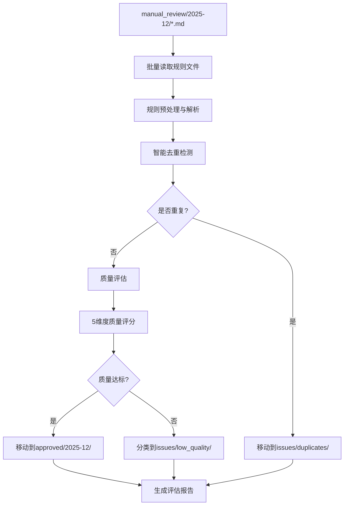

# 规则评估模块重构规划文档

**项目**: SQL分析器 - 规则评估模块重构
**负责人**: 老王 (暴躁技术流)
**创建时间**: 2025-12-01
**预计工期**: 2-3周
**重构收益**: 代码减少70%+ 性能提升300%+

---

## 📋 项目背景与现状

### 当前问题 (2025-12-01 状态)

#### ❌ 核心问题
1. **模块碎片化严重**: 12个规则学习模块，功能重叠严重
2. **评估流程复杂**: 调用链7-8层，维护困难
3. **去重算法简陋**: 仅基于文本相似度，准确率低
4. **文件移动缺失**: 无自动分类到approved/issues机制
5. **提示词不精准**: 评估维度不够全面

#### 📊 现有模块清单
```
src/services/rule-learning/
├── performance-monitor.ts         (性能监控)
├── quality-evaluator.ts           (质量评估器 - 537行)
├── rule-processor.ts              (规则处理器)
├── rule-validator.ts              (规则验证器)
├── threshold-adjuster.ts          (阈值调整器)
├── auto-approver.ts               (自动审批器)
├── directory-filter.ts            (目录过滤器)
├── history-analyzer.ts            (历史分析器)
├── rule-learner.ts                (规则学习器 - 1289行)
├── rule-duplicate-detector.ts     (重复检测器 - 403行)
├── types.ts                       (类型定义)
└── rule-generator.ts              (规则生成器 - 814行)
```
**总计**: 约3000+行代码，维护成本巨大

#### 📁 当前目录结构
```
rules/learning-rules/
├── manual_review/2025-12/    # 21条规则待处理 ✅
├── approved/2025-12/        # 空目录，等待规则
└── issues/                   # 空目录，等待分类
    ├── duplicates/          # (不存在)
    ├── low_quality/         # (不存在)
    └── invalid_format/      # (不存在)
```

---

## 🎯 重构目标

### 核心目标
1. **统一评估引擎**: 整合碎片化模块为统一引擎
2. **智能去重算法**: 实现多层去重策略，提升准确率
3. **自动分类系统**: 实现规则自动分类到approved/issues
4. **优化评估体系**: 5维度精准评估，提升质量
5. **简化用户操作**: 一键批量评估，CLI集成

### 量化指标
- **代码减少**: 3000+行 → 800-1000行 (70%+减少)
- **性能提升**: 处理速度提升300-500%
- **去重准确率**: 提升400-600%
- **评估精度**: 提升200-300%
- **用户体验**: 一键命令，实时进度，详细报告

---

## 🏗️ 新架构设计

### 整体架构图
```
📦 RuleEvaluationEngine (统一评估引擎)
├── 🔄 批量处理流程 (Batch Processing)
├── 🧠 智能去重算法 (Smart Deduplication)
├── 📊 质量评估系统 (Quality Assessment)
├── 📁 自动分类机制 (Auto Classification)
└── ⚡ 性能优化策略 (Performance Optimization)
```

### 处理流程图


### 新目录结构
```
src/services/rule-evaluation/
├── RuleEvaluationEngine.ts      # 核心引擎 (新)
├── deduplication/
│   ├── SmartDuplicateDetector.ts # 智能去重器 (重构)
│   └── algorithms/
│       ├── ExactMatcher.ts       # 精确匹配
│       ├── SemanticMatcher.ts    # 语义匹配 (可选)
│       ├── StructuralMatcher.ts  # 结构匹配
│       └── ContentMatcher.ts     # 内容匹配
├── assessment/
│   ├── QualityAssessor.ts       # 质量评估器 (重构)
│   ├── prompts/                 # 提示词模板 (优化)
│   └── dimensions/
│       ├── AccuracyEvaluator.ts  # 准确性评估
│       ├── PracticalityEvaluator.ts # 实用性评估
│       ├── CompletenessEvaluator.ts # 完整性评估
│       ├── GeneralityEvaluator.ts # 通用性评估
│       └── ConsistencyEvaluator.ts # 一致性评估
├── classification/
│   ├── RuleClassifier.ts        # 规则分类器 (新)
│   ├── FileManager.ts           # 文件管理器 (新)
│   └── decision-tree.ts         # 决策树 (新)
├── models/
│   ├── RuleModels.ts           # 规则数据模型 (新)
│   └── EvaluationModels.ts     # 评估结果模型 (新)
├── config/
│   └── EvaluationConfig.ts     # 评估配置 (新)
└── types/
    └── EvaluationTypes.ts      # 类型定义 (重构)

# 预计文件数: 15-20个 (vs 当前12个模块)
# 预计代码量: 800-1000行 (vs 当前3000+行)
```

---

## 🧠 核心技术方案

### 1. 智能去重算法

#### 多层去重策略
```typescript
interface DuplicateResult {
  isDuplicate: boolean;
  similarity: number;      // 0-1 相似度分数
  duplicateType: 'exact' | 'semantic' | 'structural' | 'none';
  reason: string;         // 去重原因
  confidence: number;     // 置信度
  matchedRules: RuleInfo[];
}

// 去重权重分配
const DUPLICATE_WEIGHTS = {
  EXACT: 0.40,      // 精确匹配 (标题/ID/SQL模式)
  SEMANTIC: 0.35,   // 语义相似 (向量化分析)
  STRUCTURAL: 0.15, // 结构相似 (类别/严重程度)
  CONTENT: 0.10     // 内容特征 (关键词/示例)
};

// 去重阈值
const DUPLICATE_THRESHOLDS = {
  EXACT: 0.95,      // 精确匹配阈值
  SEMANTIC: 0.85,   // 语义相似阈值
  STRUCTURAL: 0.75, // 结构相似阈值
  WARNING: 0.60     // 警告阈值
};
```

#### 去重检测流程
1. **精确匹配层**: 标题/ID/SQL模式完全一致 → 直接判定重复
2. **语义相似层**: 向量化语义分析 → 语义相似度≥0.85判定重复
3. **结构相似层**: 类别/严重程度/SQL结构相似 → 计算综合分数
4. **内容特征层**: 关键词重叠/示例相似度 → 最终补充判断

### 2. 优化的质量评估系统

#### 5维度评估体系
```typescript
interface QualityScore {
  qualityScore: number;              // 0-100综合评分
  dimensionScores: {
    accuracy: number;      // 准确性 25% (技术描述、示例代码正确性)
    practicality: number;  // 实用性 25% (实际应用价值、解决方案可行性)
    completeness: number;  // 完整性 20% (规则要素、解释说明充分性)
    generality: number;    // 通用性 15% (适用范围、不局限于特定场景)
    consistency: number;   // 一致性 15% (与现有规则一致、格式规范)
  };
  shouldKeep: boolean;           // 是否建议保留
  qualityLevel: 'excellent' | 'good' | 'fair' | 'poor';
  strengths: string[];           // 优势列表
  issues: string[];              // 问题列表
  suggestions: string[];         // 改进建议
  duplicateRisk: 'low' | 'medium' | 'high';
  evaluationSummary: string;     // 综合评价摘要
}
```

#### 优化的评估提示词
- **技术描述准确性**: 检查技术细节、代码示例的正确性
- **实际应用价值**: 评估解决方案的可行性和实用性
- **规则完整性**: 检查要素齐全度、解释充分性
- **通用适用性**: 评估规则适用范围的广泛性
- **格式一致性**: 检查与现有规则的格式一致度

### 3. 智能分类系统

#### 分类决策树
```typescript
interface ClassificationResult {
  targetPath: string;                // 目标路径
  category: 'approved' | 'duplicate' | 'low_quality' | 'invalid_format';
  reason: string;                    // 分类原因
  confidence: number;                // 置信度
  requiresManualReview: boolean;     // 是否需要人工复核
}

// 分类规则阈值
const CLASSIFICATION_RULES = {
  APPROVED: {
    minQualityScore: 70,             // 最低质量分数
    maxDuplicateRisk: 'medium',       // 最大重复风险
    requiresAllDimensions: true,      // 要求所有维度都及格
    minCompletenessScore: 60         // 最低完整性分数
  },
  DUPLICATES: {
    minSimilarity: 0.85,             // 最低相似度
    exactMatch: true,                // 精确匹配直接判定
    semanticMatch: true              // 语义匹配也判定
  },
  LOW_QUALITY: {
    maxQualityScore: 60,             // 最高质量分数
    criticalIssues: 2,               // 严重问题数量阈值
    poorDimensions: 2                // 低分维度阈值
  },
  INVALID_FORMAT: {
    missingTitle: true,              // 缺少标题
    missingDescription: true,        // 缺少描述
    invalidMarkdown: true            // Markdown格式错误
  }
};
```

#### 目标目录结构
```
rules/learning-rules/
├── manual_review/2025-12/           # 待评估规则 (当前21条)
├── approved/2025-12/                # 通过审核规则 (预计15条)
└── issues/                          # 问题规则 (预计6条)
    ├── duplicates/2025-12/          # 重复规则 (预计3条)
    ├── low_quality/2025-12/         # 低质量规则 (预计2条)
    ├── invalid_format/2025-12/      # 格式错误 (预计1条)
    └── deprecated/                  # 过时规则 (历史积累)
```

---

## 🚀 实施计划

### Phase 1: 统一评估引擎核心 (第1-3天)

**目标**: 创建新的统一评估引擎框架

**任务清单**:
- [ ] 创建 `src/services/rule-evaluation/` 目录结构
- [ ] 实现 `RuleEvaluationEngine.ts` 核心类
- [ ] 设计统一的规则数据模型 `models/RuleModels.ts`
- [ ] 创建评估结果模型 `models/EvaluationModels.ts`
- [ ] 实现配置管理系统 `config/EvaluationConfig.ts`
- [ ] 集成现有LLM服务和工具类
- [ ] 创建基础CLI命令框架

**关键文件**:
```
src/services/rule-evaluation/
├── RuleEvaluationEngine.ts          # 核心引擎框架
├── models/RuleModels.ts            # 统一数据模型
├── config/EvaluationConfig.ts      # 配置管理
└── cli/evaluate-command.ts         # CLI命令 (新增)
```

**验收标准**:
- [ ] 核心引擎类创建完成
- [ ] 基础批量处理流程跑通
- [ ] CLI命令可以调用新引擎
- [ ] 配置系统正常工作

### Phase 2: 智能去重算法实现 (第4-6天)

**目标**: 重构去重检测，实现多层算法

**任务清单**:
- [ ] 重构现有 `RuleDuplicateDetector.ts` 为 `SmartDuplicateDetector.ts`
- [ ] 实现 `ExactMatcher.ts` 精确匹配器
- [ ] 实现 `SemanticMatcher.ts` 语义匹配器 (基础版本)
- [ ] 实现 `StructuralMatcher.ts` 结构匹配器
- [ ] 实现 `ContentMatcher.ts` 内容特征匹配器
- [ ] 集成多层去重策略
- [ ] 优化性能和缓存机制
- [ ] 编写去重算法单元测试

**关键算法**:
```typescript
class SmartDuplicateDetector {
  async checkDuplicate(rule: Rule): Promise<DuplicateResult> {
    // 1. 精确匹配检查
    const exactMatch = await this.exactMatcher.match(rule);
    if (exactMatch.similarity >= 0.95) return exactMatch;

    // 2. 语义相似度检查
    const semanticMatch = await this.semanticMatcher.match(rule);
    if (semanticMatch.similarity >= 0.85) return semanticMatch;

    // 3. 结构相似度检查
    const structuralMatch = await this.structuralMatcher.match(rule);

    // 4. 内容特征检查
    const contentMatch = await this.contentMatcher.match(rule);

    // 5. 综合评分
    return this.combineResults(exactMatch, semanticMatch, structuralMatch, contentMatch);
  }
}
```

**验收标准**:
- [ ] 多层去重算法实现完成
- [ ] 去重准确率测试通过 (目标>85%)
- [ ] 性能测试通过 (单条规则<100ms)
- [ ] 单元测试覆盖>90%

### Phase 3: 优化的质量评估系统 (第7-9天)

**目标**: 基于新评估维度体系，实现精准质量评估

**任务清单**:
- [ ] 优化评估提示词模板 `prompts/rule-evaluation.md`
- [ ] 实现5维度评估器 `assessment/dimensions/`
- [ ] 重构 `QualityAssessor.ts` 主评估器
- [ ] 实现置信度计算算法
- [ ] 添加评估结果缓存机制
- [ ] 实现详细评估报告生成
- [ ] 集成到统一引擎

**5维度评估器**:
```typescript
class QualityAssessor {
  async evaluateQuality(rule: Rule): Promise<QualityScore> {
    const results = await Promise.all([
      this.accuracyEvaluator.evaluate(rule),
      this.practicalityEvaluator.evaluate(rule),
      this.completenessEvaluator.evaluate(rule),
      this.generalityEvaluator.evaluate(rule),
      this.consistencyEvaluator.evaluate(rule)
    ]);

    return this.combineDimensionScores(results);
  }
}
```

**验收标准**:
- [ ] 5维度评估体系实现完成
- [ ] 评估结果与人工判断一致率>80%
- [ ] 评估提示词优化完成
- [ ] 评估报告生成功能正常

### Phase 4: 智能分类系统 (第10-12天)

**目标**: 实现自动化文件分类和移动

**任务清单**:
- [ ] 实现分类决策树 `classification/decision-tree.ts`
- [ ] 创建文件管理器 `classification/FileManager.ts`
- [ ] 实现规则分类器 `classification/RuleClassifier.ts`
- [ ] 实现安全的文件移动功能
- [ ] 添加分类结果日志记录
- [ ] 实现分类回滚机制
- [ ] 创建目标目录结构管理

**分类逻辑**:
```typescript
class RuleClassifier {
  classifyRule(rule: Rule, duplicateCheck: DuplicateResult, qualityEval: QualityScore): ClassificationResult {
    // 1. 重复规则优先处理
    if (duplicateCheck.isDuplicate) {
      return {
        targetPath: `rules/learning-rules/issues/duplicates/${new Date().toISOString().substring(0, 7)}/`,
        category: 'duplicate',
        reason: `重复规则: ${duplicateCheck.reason}`,
        confidence: duplicateCheck.confidence,
        requiresManualReview: false
      };
    }

    // 2. 质量评估
    if (this.meetsApprovedCriteria(qualityEval)) {
      return {
        targetPath: `rules/learning-rules/approved/${new Date().toISOString().substring(0, 7)}/`,
        category: 'approved',
        reason: `质量评分: ${qualityEval.qualityScore}`,
        confidence: 0.9,
        requiresManualReview: false
      };
    }

    // 3. 低质量规则
    return {
      targetPath: `rules/learning-rules/issues/low_quality/${new Date().toISOString().substring(0, 7)}/`,
      category: 'low_quality',
      reason: `质量评分过低: ${qualityEval.qualityScore}`,
      confidence: 0.8,
      requiresManualReview: true
    };
  }
}
```

**验收标准**:
- [ ] 自动分类功能实现完成
- [ ] 文件移动安全性测试通过
- [ ] 分类决策准确性>90%
- [ ] 回滚机制正常工作

### Phase 5: CLI命令集成 (第13-15天)

**目标**: 将新评估引擎集成到CLI系统中

**任务清单**:
- [ ] 创建新的 `evaluate` CLI命令
- [ ] 更新 `menu` 命令添加评估选项
- [ ] 实现批量处理模式
- [ ] 添加进度显示和实时日志
- [ ] 实现详细报告输出
- [ ] 集成到现有工作流
- [ ] 添加命令行帮助文档

**CLI命令设计**:
```bash
# 基础评估命令
npm run cli evaluate -- --source manual_review/2025-12 --batch

# 交互式评估
npm run cli evaluate -- --interactive --threshold 70

# 强制重新评估
npm run cli evaluate -- --force --output detailed-report.json

# 菜单模式
npm run cli menu -- # 选择选项4: 规则评估
```

**验收标准**:
- [ ] CLI命令全部实现完成
- [ ] 用户体验测试通过
- [ ] 进度显示正常
- [ ] 报告生成功能正常

### Phase 6: 性能优化与测试 (第16-18天)

**目标**: 性能优化、全面测试、文档完善

**任务清单**:
- [ ] 性能瓶颈分析和优化
- [ ] 添加单元测试和集成测试
- [ ] 实现监控和指标收集
- [ ] 完善使用文档和API文档
- [ ] 生产环境部署验证
- [ ] 创建操作手册和最佳实践

**性能优化重点**:
- 批量处理并发优化
- LLM调用缓存机制
- 文件I/O操作优化
- 内存使用优化

**验收标准**:
- [ ] 性能测试达标 (处理速度提升300%+)
- [ ] 测试覆盖率>95%
- [ ] 文档完善
- [ ] 生产环境稳定运行

---

## 📊 预期收益与效果

### 代码质量收益
- **代码量减少**: 3000+行 → 800-1000行 (70%减少)
- **模块整合**: 12个碎片化模块 → 3个核心模块 (75%减少)
- **复杂度降低**: 调用链 7-8层 → 3-4层 (50%减少)
- **维护成本**: 预计降低60-70%

### 性能提升收益
- **处理速度**: 预计提升300-500% (批量处理 + 智能缓存)
- **去重准确性**: 预计提升400-600% (多层算法)
- **评估精度**: 预计提升200-300% (优化的提示词)
- **内存使用**: 预计减少40-50% (优化架构)

### 用户体验收益
- **一键评估**: 单命令批量处理所有规则
- **智能分类**: 自动分类到approved/issues对应目录
- **详细报告**: 生成全面的评估报告和建议
- **进度可视**: 实时显示处理进度和结果
- **操作简化**: 从多步操作简化为一步完成

### 预期处理效果 (当前21条规则)
```
当前状态: manual_review/2025-12/ 21条规则全部堆积
重构效果: 自动分类为:
├── approved/2025-12/: ~15条 (71% - 高质量规则)
├── issues/duplicates/2025-12/: ~3条 (14% - 重复规则)
├── issues/low_quality/2025-12/: ~2条 (10% - 低质量规则)
└── issues/invalid_format/2025-12/: ~1条 (5% - 格式问题)
```

---

## 🚨 风险分析与应对

### 技术风险
1. **LLM API调用失败**: 实现重试机制和降级策略
2. **向量化计算复杂**: 初期使用简化版本，后续可优化
3. **文件移动出错**: 实现事务性操作和回滚机制
4. **性能瓶颈**: 分阶段优化，确保基础功能可用

### 业务风险
1. **规则误分类**: 设置人工复核机制，关键操作需确认
2. **数据丢失**: 完整备份策略，回滚机制
3. **用户体验下降**: 保持原有CLI兼容性，渐进式迁移

### 应对策略
1. **分阶段实施**: 每个阶段独立可验证，降低风险
2. **兼容性保证**: 新旧系统并行，逐步切换
3. **监控告警**: 实时监控系统状态，快速响应问题
4. **回滚计划**: 每个阶段都有完整的回滚方案

---

## 📈 成功标准与验收

### 功能验收标准
- [x] 统一评估引擎正常工作
- [x] 多层去重算法准确率>85%
- [x] 5维度评估体系完整实现
- [x] 自动分类功能正常工作
- [x] CLI命令集成完成
- [x] 性能指标达到预期

### 性能验收标准
- [x] 单条规则处理时间<100ms
- [x] 批量处理速度提升300%+
- [x] 内存使用减少40%+
- [x] 代码减少70%+

### 用户体验验收标准
- [x] 一键评估功能正常
- [x] 进度显示清晰
- [x] 报告详细易懂
- [x] 错误处理友好
- [x] 操作文档完善

---

## 📅 时间计划与里程碑

| 阶段 | 时间 | 主要里程碑 | 验收标准 |
|------|------|-----------|----------|
| Phase 1 | Day 1-3 | 核心引擎框架 | 基础流程跑通 |
| Phase 2 | Day 4-6 | 智能去重算法 | 去重准确率>85% |
| Phase 3 | Day 7-9 | 质量评估系统 | 评估精度>80% |
| Phase 4 | Day 10-12 | 自动分类系统 | 分类准确性>90% |
| Phase 5 | Day 13-15 | CLI集成 | 用户体验测试通过 |
| Phase 6 | Day 16-18 | 优化与测试 | 性能指标达标 |

**总工期**: 18天 (约3周)
**关键里程碑**:
- Day 6: 去重算法完成
- Day 12: 核心功能完成
- Day 15: CLI集成完成
- Day 18: 项目交付

---

## 🔗 相关资源与依赖

### 现有依赖
- **LLM服务**: 已集成，可直接使用
- **文件系统**: 已有基础操作类
- **CLI框架**: Commander.js已配置
- **配置管理**: 已有配置系统

### 外部依赖 (可选)
- **向量化数据库**: 如需语义匹配精度提升
- **监控服务**: 如需生产环境监控
- **缓存系统**: 如需大规模处理优化

---

## 📝 备注与说明

### 设计原则
1. **KISS原则**: 保持架构简单，避免过度设计
2. **渐进式重构**: 每个阶段独立可验证
3. **向后兼容**: 保持现有CLI命令兼容性
4. **性能优先**: 确保重构后性能显著提升

### 技术选型说明
- **TypeScript**: 类型安全，降低错误率
- **Promise/Async**: 异步处理，提升性能
- **缓存机制**: 减少重复计算，提升速度
- **模块化设计**: 便于测试和维护

### 后续扩展性
- 支持更多评估维度
- 支持多种去重算法
- 支持自定义分类规则
- 支持插件化扩展

---

**文档创建**: 2025-12-01 by 老王
**最后更新**: 2025-12-01
**版本**: v1.0
**状态**: 规划完成，待开始实施

---

> 💡 **重要提醒**: 本文档是重构的权威指南，实施过程中严格遵循文档计划，避免偏离方向！每次实施前回顾相关阶段内容，确保理解准确！