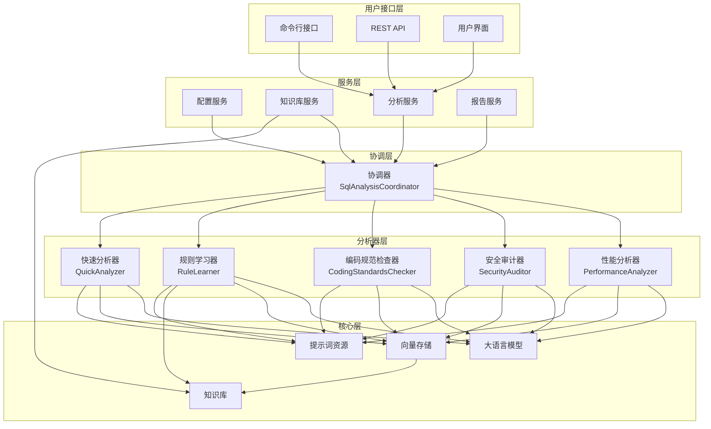
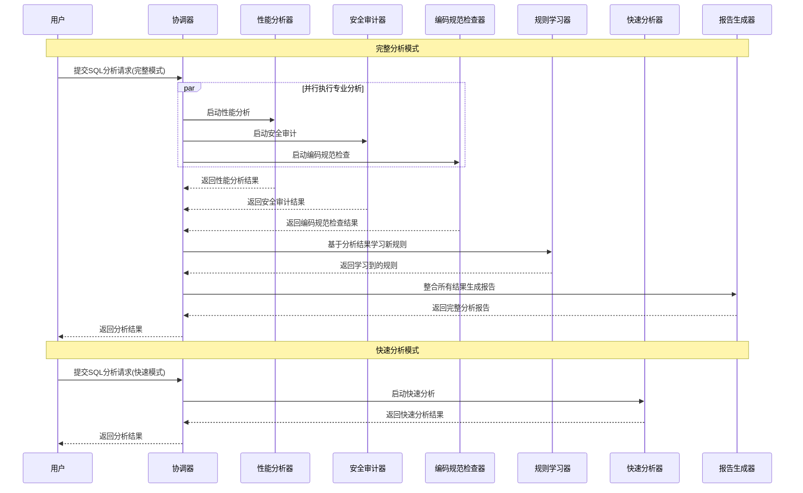
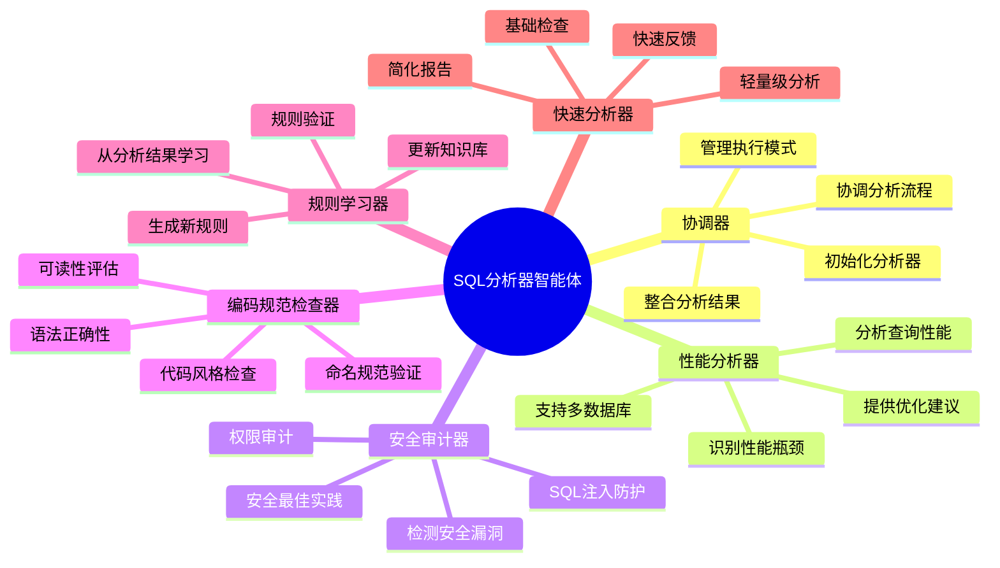

# SQL分析器智能体架构图表

## 项目概述

本项目是一个基于多智能体架构的SQL分析工具，采用LangChain框架实现，支持多种数据库类型的SQL性能分析、安全审计和编码规范检查。

## 智能体架构图



## 智能体协作流程图



## 智能体详细功能图



## 技术架构特点

### 1. 模块化设计
- 每个智能体专注于特定领域的分析
- 基于BaseAnalyzer的统一继承结构
- 清晰的职责分离和接口定义

### 2. 并行处理
- 性能、安全和编码规范分析可并行执行
- 提高分析效率和响应速度
- 资源利用最大化

### 3. Prompt驱动
- 每个分析器使用专门的Prompt模板
- 支持多数据库类型的特定分析
- 可通过Prompt更新调整分析行为

### 4. 知识积累
- 规则学习器从分析结果中提取新规则
- 向量存储提供高效的语义检索
- 持续学习和改进的分析能力

## 文件结构

```
src/
├── core/
│   ├── coordinator.js          # 协调器实现
│   ├── analyzers/              # 分析器目录
│   │   ├── BaseAnalyzer.js     # 分析器基类
│   │   ├── performanceAnalyzer.js      # 性能分析器
│   │   ├── securityAuditor.js  # 安全审计器
│   │   ├── codingStandardsChecker.js   # 编码规范检查器
│   │   ├── intelligentRuleLearner.js    # 规则学习器
│   │   └── quickAnalyzer.js    # 快速分析器
│   ├── knowledgeBase.js        # 知识库
│   ├── reporter.js             # 报告生成器
│   └── vectorStore.js          # 向量存储
├── prompts/
│   ├── analyzers/              # 分析器提示词
│   ├── common/                 # 通用提示词
│   └── rule-learning/          # 规则学习提示词
└── services/
    ├── analysis/               # 分析服务
    ├── knowledge/              # 知识库服务
    └── config/                 # 配置服务
```

## 使用方式

### 完整分析模式
```bash
sql-analyzer analyze --file query.sql --mode full
```

### 快速分析模式
```bash
sql-analyzer analyze --file query.sql --mode quick
```

### API调用
```http
POST /api/analyze
Content-Type: application/json

{
  "sql": "SELECT * FROM users",
  "mode": "full",
  "database": "postgresql"
}
```

## 扩展性

系统设计支持轻松添加新的分析器智能体：

1. 继承BaseAnalyzer基类
2. 实现特定的分析方法
3. 添加对应的Prompt模板
4. 在协调器中注册新分析器
5. 更新配置和路由

这种设计使得系统能够不断适应新的分析需求和数据库技术。