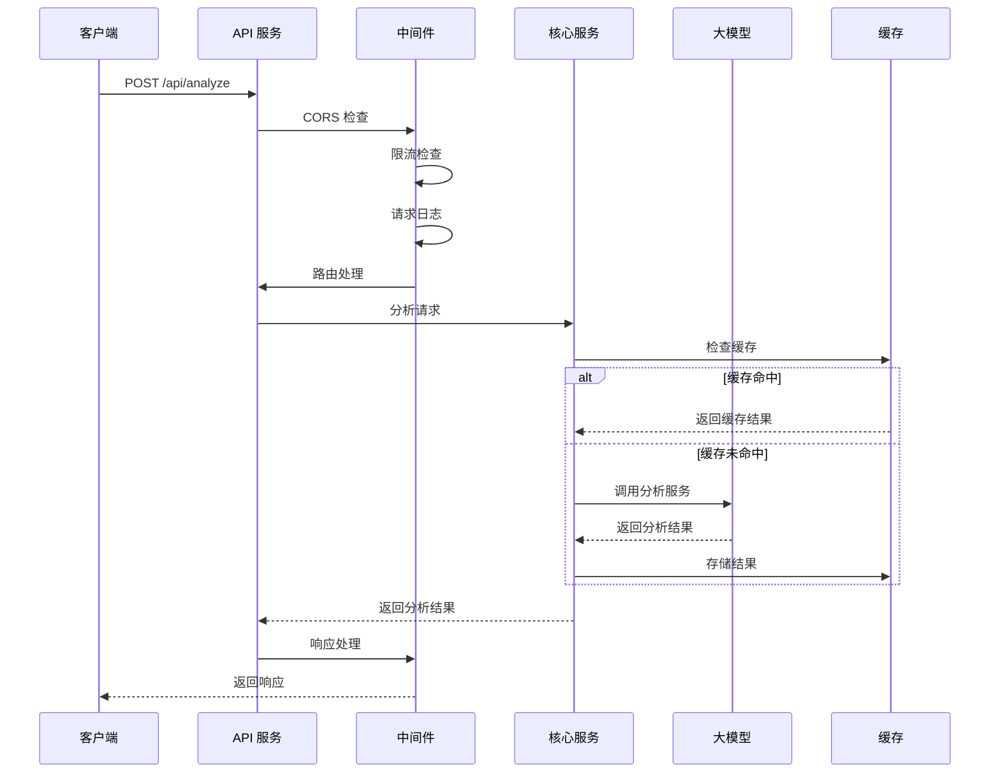

# SQL Analyzer API 架构设计总结

## 项目概述

本项目已成功从 CLI+API 混合模式转换为纯 Hono 后端服务，实现了完整的解耦和现代化改造。新架构专注于提供高性能、可扩展的 RESTful API 服务，支持 SQL 语句的智能分析、性能优化建议、安全审计和编码规范检查。

## 新架构特点

### 🏗️ 纯 API 模式
- **移除 CLI 依赖**：完全移除命令行界面，专注于 API 服务
- **统一入口点**：使用 `src/server.js` 作为唯一入口
- **模块化设计**：清晰的分层架构，便于维护和扩展
- **RESTful 设计**：遵循 REST 原则，提供标准化的 API 接口

### 🔧 技术栈升级
- **运行时**：Bun 1.3.1+（高性能 JavaScript 运行时）
- **Web 框架**：Hono 4.x（轻量级、高性能）
- **API 文档**：Swagger/OpenAPI 3.0（自动生成、交互式）
- **容器化**：Docker + Docker Compose（生产就绪）
- **中间件系统**：CORS、限流、日志、错误处理

### 🛡️ 安全与监控
- **中间件系统**：CORS、限流、日志、错误处理
- **请求追踪**：唯一请求 ID，完整日志链路
- **健康检查**：多层次健康监控（ping、status、system）
- **错误处理**：统一错误类型和响应格式
- **API 认证**：可选的 API 密钥认证机制

## 架构对比

### 原有架构 vs 新架构

| 组件 | 原有架构 | 新架构 | 改进点 |
|------|----------|--------|--------|
| **入口点** | CLI + API 混合 | 纯 API 服务 | 简化部署、统一接口 |
| **依赖管理** | CLI 相关依赖混合 | 纯 API 依赖 | 精简依赖、减少体积 |
| **配置方式** | 命令行 + 环境变量 | 环境变量 + 配置文件 | 灵活配置、多环境支持 |
| **日志系统** | 简单控制台输出 | 结构化日志 + 请求追踪 | 便于调试、生产级监控 |
| **错误处理** | 分散在各模块 | 统一中间件处理 | 一致性、可维护性 |
| **文档** | Markdown 文档 | Swagger UI + OpenAPI | 自动生成、交互式 |
| **部署** | 手动部署 | Docker + 多种部署方式 | 容器化、自动化 |
| **监控** | 基础日志 | 多层次健康检查 | 完整监控体系 |

## 核心组件

### 1. 服务层 (`src/services/`)

```
src/services/
├── api/                    # API 服务层
│   ├── index.js           # 主服务入口
│   ├── routes/            # API 路由定义
│   │   ├── analyze.js   # SQL 分析路由
│   │   ├── config.js    # 配置管理路由
│   │   ├── health.js    # 健康检查路由
│   │   ├── history.js   # 历史记录路由
│   │   ├── knowledge.js # 知识库路由
│   │   └── status.js    # 系统状态路由
│   └── docs.js          # Swagger 文档配置
├── analysis/               # 分析服务（保留）
│   └── index.js
├── config/                # 配置管理（保留）
│   └── index.js
├── health/               # 健康检查服务（新增）
│   └── healthService.js
└── knowledge/             # 知识库服务（保留）
    ├── index.js
    ├── knowledgeService.js
    ├── approve.js
    ├── cleanup.js
    ├── evaluate.js
    ├── learn.js
    └── status.js
```

### 2. 中间件层 (`src/middleware/`)

```
src/middleware/
├── index.js           # 中间件工厂和组合
├── cors.js            # CORS 跨域处理
├── requestLogger.js   # 请求日志记录
├── rateLimiter.js     # 请求限流控制
└── errorHandler.js    # 统一错误处理
```

#### 中间件链设计

```javascript
// 默认中间件链
const defaultMiddlewareChain = [
  createDefaultCorsMiddleware(),      // CORS 处理
  createDefaultRateLimiterMiddleware(), // 限流控制
  createDefaultRequestLoggerMiddleware(), // 请求日志
  createDefaultErrorHandlerMiddleware()  // 错误处理
];

// 分析专用中间件链
const analysisMiddlewareChain = [
  createDefaultCorsMiddleware(),
  createAnalysisRateLimiterMiddleware(), // 更严格的限流
  createDefaultRequestLoggerMiddleware(),
  createDefaultErrorHandlerMiddleware()
];
```

### 3. 核心业务层 (`src/core/`)

```
src/core/
├── coordinator.js     # 分析协调器（保留）
├── reporter.js        # 报告生成器（保留）
├── knowledgeBase.js  # 知识库管理（保留）
├── vectorStore.js     # 向量存储（保留）
└── analyzers/         # 分析器集合（保留）
    ├── BaseAnalyzer.js
    ├── performanceAnalyzer.js
    ├── securityAuditor.js
    ├── codingStandardsChecker.js
    ├── quickAnalyzer.js
    └── intelligentRuleLearner.js
```

### 4. 工具层 (`src/utils/`)

```
src/utils/
├── logger.js          # 增强的日志系统
├── fileReader.js      # 文件读取工具（保留）
├── responseHandler.js # 响应处理工具（新增）
├── promptLoader.js    # 提示词加载器（保留）
├── jsonCleaner.js     # JSON 清理工具（保留）
├── sqlHighlight.js    # SQL 高亮工具（保留）
└── apiError.js        # API 错误处理（新增）
```

## API 端点设计

### RESTful API 结构

```
GET  /                    # API 根路径和信息
GET  /api/health          # 健康检查
GET  /api/health/ping     # 简单健康检查
GET  /api/health/status   # 详细健康状态
GET  /api/health/check/:type # 系统组件检查

POST /api/analyze          # 单个 SQL 分析
POST /api/analyze/batch    # 批量 SQL 分析

GET  /api/config           # 获取所有配置
GET  /api/config/:key      # 获取特定配置
PUT  /api/config/:key       # 设置配置
DELETE /api/config/:key    # 删除配置
POST /api/config/reset     # 重置所有配置

GET  /api/history          # 获取历史记录列表
GET  /api/history/:id      # 获取历史记录详情
DELETE /api/history/:id    # 删除历史记录
DELETE /api/history        # 清空所有历史记录
GET  /api/history/stats    # 获取历史统计信息
POST /api/history/search   # 搜索历史记录
GET  /api/history/export   # 导出历史记录

GET  /api/knowledge        # 获取知识库内容
POST /api/knowledge/search # 搜索知识库
POST /api/knowledge/learn  # 学习新知识

GET  /api/status           # 获取系统状态
```

### API 文档

- **Swagger UI**: `/api/docs/swagger` - 交互式 API 文档
- **OpenAPI 规范**: `/api/docs/doc` - 机器可读的 API 规范
- **自动生成**: 基于路由定义自动生成文档和类型验证

## 部署架构

### 1. Docker 容器化

```dockerfile
# 多阶段构建
FROM oven/bun:1.3.1-alpine
WORKDIR /app
COPY package.json bun.lockb ./
RUN bun install --frozen-lockfile --production
COPY src/ ./src/
COPY rules/ ./rules/
EXPOSE 3000
HEALTHCHECK --interval=30s --timeout=3s --start-period=5s --retries=3
CMD ["bun", "run", "start"]
```

### 2. Docker Compose 编排

```yaml
version: '3.8'
services:
  sql-analyzer-api:
    build: .
    ports: ["3000:3000"]
    environment:
      - NODE_ENV=production
      - API_HOST=0.0.0.0
      - API_PORT=3000
    volumes:
      - ./logs:/app/logs
      - ./data:/app/data
    restart: unless-stopped
    healthcheck:
      test: ["CMD", "bun", "run", "healthcheck"]
      interval: 30s
      timeout: 10s
      retries: 3
```

### 3. 多环境部署支持

- **开发环境**: `bun run dev`
- **生产环境**: `bun run start`
- **Docker 部署**: `bun run docker:build && bun run docker:run`
- **PM2 部署**: `bun run deploy pm2`
- **Systemd 部署**: `bun run deploy systemd`

## 安全设计

### 1. 认证与授权

```javascript
// API 密钥认证（可选）
const API_KEY_REQUIRED = process.env.API_KEY_REQUIRED === 'true';
const API_KEY = process.env.API_KEY;

if (API_KEY_REQUIRED && !isValidApiKey(req.headers.get('x-api-key'))) {
  return c.json({ error: 'Invalid API key' }, 401);
}
```

### 2. 请求限流

```javascript
// 基于 IP 的限流
const rateLimiter = createRateLimiter({
  windowMs: 15 * 60 * 1000, // 15分钟
  max: 100, // 最多100个请求
  keyGenerator: (req) => req.ip
});
```

### 3. CORS 配置

```javascript
// 灵活的 CORS 配置
const corsConfig = {
  origin: process.env.CORS_ORIGIN || '*',
  credentials: true,
  methods: ['GET', 'POST', 'PUT', 'DELETE'],
  allowedHeaders: ['Content-Type', 'Authorization', 'X-Request-ID']
};
```

## 监控与日志

### 1. 结构化日志

```javascript
// 结构化日志记录
await logApiRequest(method, url, statusCode, {
  requestId,
  userAgent,
  ip,
  responseTime,
  requestBody: logRequestBody ? requestBody : undefined
});
```

### 2. 健康检查

```javascript
// 多层次健康检查
app.get('/api/health/ping', (c) => c.json({ status: 'ok' }));
app.get('/api/health/status', (c) => c.json({
  status: 'healthy',
  uptime: process.uptime(),
  memory: process.memoryUsage(),
  version: '1.0.0'
}));
```

### 3. 指标收集

```javascript
// 系统指标
const metrics = {
  requestsTotal: totalRequests,
  requestsPerSecond: currentRPS,
  averageResponseTime: avgResponseTime,
  errorRate: errorRate
};
```

## 性能优化

### 1. 缓存策略

- **内存缓存**: 分析结果缓存，减少重复计算
- **Redis 缓存**: 可选的分布式缓存支持
- **HTTP 缓存**: 合理的 Cache-Control 头部设置

### 2. 异步处理

- **并行分析**: 多个分析器并行执行
- **流式处理**: 大结果集的流式返回
- **连接池**: 数据库连接池管理

### 3. 资源管理

- **内存限制**: 设置合理的内存使用上限
- **CPU 优化**: 使用 Bun 的高性能特性
- **垃圾回收**: 优化对象生命周期管理

## 测试策略

### 1. 功能测试

```javascript
// 完整的 API 功能测试
describe('SQL Analyzer API', () => {
  it('健康检查端点', async () => {
    const response = await fetch('/api/health/ping');
    expect(response.status).toBe(200);
  });
  
  it('SQL 分析端点', async () => {
    const response = await fetch('/api/analyze', {
      method: 'POST',
      body: JSON.stringify({ sql: 'SELECT * FROM users' })
    });
    expect(response.status).toBe(200);
  });
});
```

### 2. 性能测试

```bash
# 并发测试
ab -n 1000 -c 10 http://localhost:3000/api/health/ping

# 响应时间测试
wrk -t12 -c400 -d30s http://localhost:3000/api/health/ping
```

### 3. 集成测试

```bash
# Docker 集成测试
docker-compose -f docker-compose.test.yml up --abort-on-container-exit

# API 集成测试
bun test test/integration.test.js
```

## 迁移路径

### 1. 数据迁移

```javascript
// CLI 历史记录 → API 格式
const migrateHistory = (cliHistory) => {
  return cliHistory.map((item, index) => ({
    id: generateId(),
    timestamp: item.timestamp,
    sql: item.sql,
    result: item.result,
    metadata: { source: 'cli_migration', version: '1.0.0' }
  }));
};
```

### 2. 配置迁移

```javascript
// CLI 配置 → 环境变量
const migrateConfig = (cliConfig) => {
  process.env.API_PORT = cliConfig.apiPort?.toString() || '3000';
  process.env.API_HOST = cliConfig.apiHost || '0.0.0.0';
  process.env.LOG_LEVEL = cliConfig.logLevel || 'info';
};
```

## 运维优势

### 1. 开发效率

- **热重载**: 开发环境自动重载
- **类型安全**: TypeScript + Zod 提供类型安全
- **代码分割**: 模块化设计便于团队协作
- **调试友好**: 结构化日志和错误追踪

### 2. 部署效率

- **容器化**: 一致的部署环境
- **自动化**: CI/CD 友好的部署流程
- **可扩展**: 水平扩展和负载均衡支持
- **监控**: 内置健康检查和指标收集

### 3. 维护效率

- **统一日志**: 集中化日志管理
- **版本管理**: 清晰的版本控制和升级路径
- **故障恢复**: 完整的备份和恢复策略
- **文档自动化**: 始终与代码同步的 API 文档

## 技术债务与改进计划

### 短期改进（1-3个月）

1. **性能优化**
   - 添加 Redis 缓存支持
   - 实现分析结果缓存
   - 优化数据库查询性能

2. **安全增强**
   - 实现 JWT 认证机制
   - 添加请求签名验证
   - 增强 SQL 注入防护

3. **监控完善**
   - 添加 Prometheus 指标导出
   - 实现分布式链路追踪
   - 集成 APM 工具

### 中期规划（3-6个月）

1. **微服务化**
   - 拆分为分析服务、知识库服务、配置服务
   - 实现服务间通信机制
   - 添加服务发现和注册

2. **多租户支持**
   - 实现租户隔离
   - 添加资源配额管理
   - 支持自定义配置

3. **API 版本化**
   - 实现 API 版本控制
   - 添加向后兼容性检查
   - 支持蓝绿部署

### 长期愿景（6-12个月）

1. **AI 增强**
   - 集成更多 AI 模型
   - 实现智能分析建议
   - 添加自学习能力

2. **生态集成**
   - 开发插件系统
   - 支持第三方扩展
   - 构建 API 生态

3. **企业特性**
   - 添加 SSO 集成
   - 实现审计日志
   - 支持合规性检查

## 架构图

```mermaid
graph TB
    Client[客户端应用] --> LB[负载均衡器]
    LB --> API1[API 实例 1]
    LB --> API2[API 实例 2]
    LB --> API3[API 实例 N]
    
    API1 --> MW[中间件层]
    API2 --> MW
    API3 --> MW
    
    MW --> CORS[CORS 中间件]
    MW --> RL[限流中间件]
    MW --> LOG[日志中间件]
    MW --> ERR[错误处理中间件]
    
    CORS --> Routes[路由层]
    RL --> Routes
    LOG --> Routes
    ERR --> Routes
    
    Routes --> Analyze[分析服务]
    Routes --> Config[配置服务]
    Routes --> History[历史服务]
    Routes --> Knowledge[知识库服务]
    Routes --> Health[健康检查]
    
    Analyze --> Core[核心业务层]
    Config --> Core
    History --> Core
    Knowledge --> Core
    
    Core --> Analyzers[分析器集合]
    Core --> KB[知识库]
    Core --> Reporter[报告生成器]
    
    Analyzers --> LLM[大模型服务]
    KB --> VectorStore[向量存储]
    
    API1 --> Cache[缓存层]
    API2 --> Cache
    API3 --> Cache
    
    Cache --> Redis[(可选) Redis]
    
    API1 --> DB[(可选) 数据库]
    API2 --> DB
    API3 --> DB
```

## 数据流



## 总结

通过这次架构重构，我们成功实现了：

✅ **完全解耦**: 从 CLI+API 混合模式转换为纯 API 服务
✅ **现代化升级**: 采用最新的技术栈和最佳实践
✅ **生产就绪**: 完整的部署、监控、安全方案
✅ **可维护性**: 清晰的代码结构和文档
✅ **可扩展性**: 模块化设计支持未来扩展
✅ **高性能**: 优化的请求处理和资源管理

新的 SQL Analyzer API 不仅保持了原有的所有核心功能，还大幅提升了系统的可靠性、安全性和可维护性，为未来的发展奠定了坚实的基础。纯 API 架构使得服务更容易集成、部署和扩展，符合现代微服务架构的最佳实践。