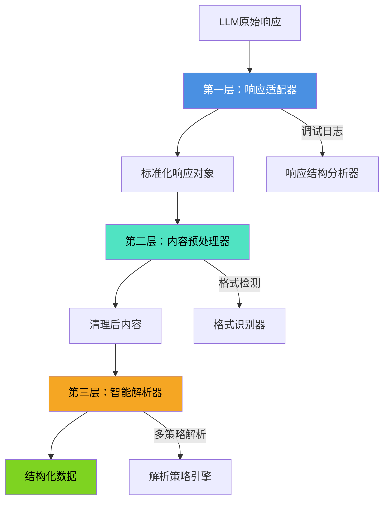
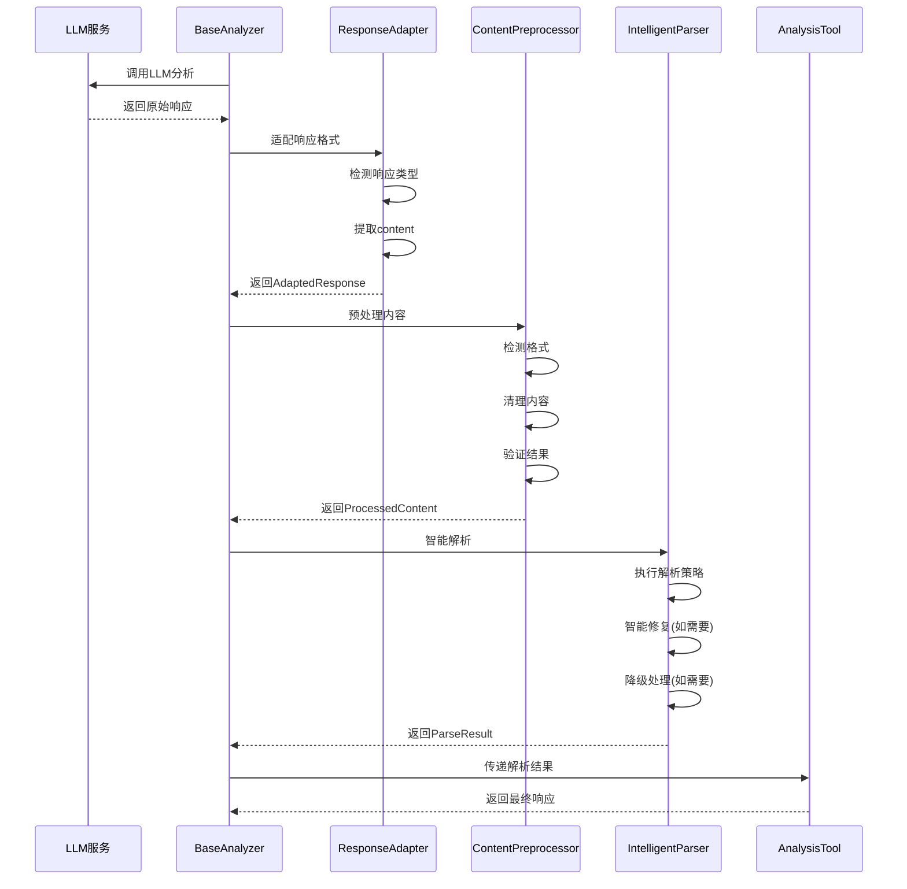

# SQL分析器三层解析架构设计文档

## 目录
1. [问题分析](#问题分析)
2. [架构总览](#架构总览)
3. [第一层：响应适配器](#第一层响应适配器)
4. [第二层：内容预处理器](#第二层内容预处理器)
5. [第三层：智能解析器](#第三层智能解析器)
6. [数据流转机制](#数据流转机制)
7. [错误处理策略](#错误处理策略)
8. [实施方案](#实施方案)
9. [API设计](#api设计)
10. [测试策略](#测试策略)
11. [性能考虑](#性能考虑)
12. [扩展性设计](#扩展性设计)

---

## 问题分析

### 当前架构的核心问题

**根本原因：LangChain AIMessage对象content字段提取逻辑错误**

```javascript
// 当前错误的实现 (base-analyzer.js:104)
const responseContent = response.content || response?.kwargs?.content || String(response);
```

**问题分析：**
1. ❌ **优先级错误**：应该优先检查`kwargs.content`，再检查`content`
2. ❌ **格式不统一**：不同LLM SDK返回的响应格式差异巨大
3. ❌ **调试困难**：缺乏详细的响应结构日志记录
4. ❌ **容错性差**：单一提取策略，容易导致content丢失

**现有架构缺陷：**
- **ResponsePreprocessor**：功能单一，只处理基础格式清理
- **StructuredParser**：5种解析策略都依赖`processedResponse.content`，但该字段可能为空
- **IntelligentRepairer**：修复机制复杂，但无法解决根本的content提取问题
- **FallbackResponseGenerator**：最后的降级方案，但用户体验差

---

## 架构总览

### 三层解析架构设计



### 架构优势

**1. 职责分离清晰**
- **响应适配器**：专门处理不同LLM SDK的响应格式差异
- **内容预处理器**：专注于内容清理和格式标准化
- **智能解析器**：提供多策略解析和智能修复能力

**2. 错误处理完善**
- 每层都有独立的错误检测和恢复机制
- 详细的调试日志记录，便于问题定位
- 渐进式降级策略，确保系统稳定性

**3. 扩展性强**
- 新的LLM SDK只需在响应适配器中添加支持
- 新的解析策略可以在智能解析器中轻松集成
- 模块化设计便于单独测试和维护

---

## 第一层：响应适配器

### 设计目标

统一处理不同LLM SDK的响应格式，正确提取content字段，提供详细的调试信息。

### 核心接口

```javascript
class ResponseAdapter {
  /**
   * 适配LLM响应
   * @param {any} rawResponse - 原始LLM响应
   * @param {Object} options - 适配选项
   * @returns {AdaptedResponse} 标准化响应对象
   */
  static adapt(rawResponse, options = {})
  
  /**
   * 检测响应类型
   * @param {any} response - 响应对象
   * @returns {string} 响应类型
   */
  static detectResponseType(response)
  
  /**
   * 提取content内容
   * @param {any} response - 响应对象
   * @param {string} responseType - 响应类型
   * @returns {string} 提取的content
   */
  static extractContent(response, responseType)
}
```

### 数据结构

```javascript
/**
 * 标准化响应对象
 */
class AdaptedResponse {
  constructor() {
    this.content = ''           // 提取的content内容
    this.metadata = {           // 响应元数据
      responseType: '',        // 响应类型
      originalStructure: {},    // 原始响应结构
      extractionPath: '',      // content提取路径
      hasKwargs: false,        // 是否包含kwargs
      hasContent: false,       // 是否包含content
      extractionConfidence: 0  // 提取置信度
    }
    this.debug = {              // 调试信息
      extractionSteps: [],      // 提取步骤记录
      warnings: [],            // 警告信息
      errors: []               // 错误信息
    }
  }
}
```

### 支持的响应类型

**1. LangChain AIMessage**
```javascript
// LangChain响应结构
{
  lc_serializable: true,
  lc_kwargs: {
    content: "实际的JSON内容",
    additional_kwargs: {}
  },
  content: "可能为空或格式不正确"
}

// 提取策略：优先使用 kwargs.content
```

**2. OpenAI ChatCompletion**
```javascript
// OpenAI响应结构
{
  id: "chatcmpl-xxx",
  object: "chat.completion",
  choices: [{
    message: {
      content: "实际的JSON内容",
      role: "assistant"
    }
  }]
}

// 提取策略：choices[0].message.content
```

**3. Anthropic Claude**
```javascript
// Anthropic响应结构
{
  id: "msg_xxx",
  type: "message",
  content: [{
    type: "text",
    text: "实际的JSON内容"
  }]
}

// 提取策略：content[0].text
```

**4. 原始字符串响应**
```javascript
// 直接返回字符串内容
```

### 实现示例

```javascript
class ResponseAdapter {
  static adapt(rawResponse, options = {}) {
    const adapted = new AdaptedResponse();
    
    try {
      // 1. 检测响应类型
      const responseType = this.detectResponseType(rawResponse);
      adapted.metadata.responseType = responseType;
      
      // 2. 记录原始结构
      adapted.metadata.originalStructure = this.sanitizeStructure(rawResponse);
      
      // 3. 提取content
      const content = this.extractContent(rawResponse, responseType);
      adapted.content = content;
      
      // 4. 记录提取路径
      adapted.metadata.extractionPath = this.getExtractionPath(responseType);
      
      // 5. 计算提取置信度
      adapted.metadata.extractionConfidence = this.calculateConfidence(content, responseType);
      
      // 6. 记录调试信息
      adapted.debug.extractionSteps = this.getExtractionSteps(responseType);
      
      return adapted;
    } catch (error) {
      adapted.debug.errors.push(`适配失败: ${error.message}`);
      return adapted;
    }
  }
  
  static detectResponseType(response) {
    if (this.isLangChainMessage(response)) {
      return 'langchain_aimessage';
    }
    if (this.isOpenAIResponse(response)) {
      return 'openai_chatcompletion';
    }
    if (this.isAnthropicResponse(response)) {
      return 'anthropic_message';
    }
    if (typeof response === 'string') {
      return 'raw_string';
    }
    return 'unknown';
  }
  
  static extractContent(response, responseType) {
    switch (responseType) {
      case 'langchain_aimessage':
        // 修复：优先使用 kwargs.content
        return response?.kwargs?.content || 
               response?.content || 
               response?.lc_kwargs?.content || 
               '';
      
      case 'openai_chatcompletion':
        return response?.choices?.[0]?.message?.content || '';
      
      case 'anthropic_message':
        return response?.content?.[0]?.text || '';
      
      case 'raw_string':
        return response;
      
      default:
        return String(response);
    }
  }
  
  static isLangChainMessage(response) {
    return response && 
           (response.lc_serializable === true || 
            response.lc_kwargs !== undefined ||
            response.kwargs !== undefined);
  }
  
  static isOpenAIResponse(response) {
    return response && 
           response.choices && 
           Array.isArray(response.choices);
  }
  
  static isAnthropicResponse(response) {
    return response && 
           response.type === 'message' && 
           Array.isArray(response.content);
  }
}
```

---

## 第二层：内容预处理器

### 设计目标

清理和标准化content内容，移除无关标记，为后续解析做准备。

### 核心接口

```javascript
class ContentPreprocessor {
  /**
   * 预处理内容
   * @param {AdaptedResponse} adaptedResponse - 适配后的响应
   * @param {Object} options - 预处理选项
   * @returns {ProcessedContent} 处理后的内容
   */
  static process(adaptedResponse, options = {})
  
  /**
   * 检测内容格式
   * @param {string} content - 内容
   * @returns {FormatInfo} 格式信息
   */
  static detectFormat(content)
  
  /**
   * 清理内容
   * @param {string} content - 原始内容
   * @param {FormatInfo} formatInfo - 格式信息
   * @returns {string} 清理后的内容
   */
  static cleanContent(content, formatInfo)
}
```

### 数据结构

```javascript
/**
 * 处理后的内容对象
 */
class ProcessedContent {
  constructor() {
    this.content = ''           // 清理后的内容
    this.format = {             // 格式信息
      type: '',                // 格式类型：json, markdown, mixed, unknown
      hasCodeBlock: false,     // 是否包含代码块
      hasMarkdown: false,      // 是否包含markdown标记
      hasComments: false,      // 是否包含注释
      hasVariables: false      // 是否包含变量声明
    }
    this.cleaning = {           // 清理信息
      removedMarkdown: false,   // 是否移除了markdown
      removedComments: false,   // 是否移除了注释
      removedVariables: false,   // 是否移除了变量
      extractedJSON: false,     // 是否提取了JSON
      appliedRules: []          // 应用的清理规则
    }
    this.validation = {          // 验证信息
      isValid: false,           // 是否有效
      issues: [],               // 问题列表
      suggestions: []           // 建议列表
    }
    this.metadata = {            // 元数据
      originalLength: 0,        // 原始长度
      processedLength: 0,      // 处理后长度
      compressionRatio: 0,      // 压缩比例
      processingTime: 0         // 处理时间
    }
  }
}
```

### 清理策略

**1. Markdown清理**
```javascript
// 移除代码块标记
content = content.replace(/^```(?:json|javascript|js)?\s*/i, '');
content = content.replace(/\s*```$/, '');

// 移除其他markdown标记
content = content.replace(/\*\*(.*?)\*\*/g, '$1');  // 粗体
content = content.replace(/\*(.*?)\*/g, '$1');      // 斜体
content = content.replace(/`(.*?)`/g, '$1');        // 行内代码
```

**2. 注释清理**
```javascript
// 移除单行注释
content = content.replace(/\/\/.*$/gm, '');

// 移除多行注释
content = content.replace(/\/\*[\s\S]*?\*\//g, '');

// 移除HTML注释
content = content.replace(/<!--[\s\S]*?-->/g, '');
```

**3. 变量声明清理**
```javascript
// 移除JavaScript变量声明
content = content.replace(/^(const|let|var)\s+\w+\s*=\s*/gm, '');

// 移除Python变量声明
content = content.replace(/^\w+\s*=\s*/gm, '');
```

**4. JSON提取**
```javascript
// 智能提取JSON对象
const jsonStart = content.indexOf('{');
const jsonEnd = content.lastIndexOf('}');

if (jsonStart !== -1 && jsonEnd !== -1 && jsonEnd > jsonStart) {
  content = content.substring(jsonStart, jsonEnd + 1);
}
```

### 实现示例

```javascript
class ContentPreprocessor {
  static process(adaptedResponse, options = {}) {
    const startTime = Date.now();
    const processed = new ProcessedContent();
    
    try {
      const content = adaptedResponse.content;
      
      // 1. 记录原始信息
      processed.metadata.originalLength = content.length;
      
      // 2. 检测格式
      const formatInfo = this.detectFormat(content);
      processed.format = formatInfo;
      
      // 3. 清理内容
      const cleanedContent = this.cleanContent(content, formatInfo);
      processed.content = cleanedContent;
      
      // 4. 记录清理信息
      processed.cleaning = this.getCleaningInfo(content, cleanedContent, formatInfo);
      
      // 5. 验证结果
      processed.validation = this.validateContent(cleanedContent);
      
      // 6. 计算元数据
      processed.metadata.processedLength = cleanedContent.length;
      processed.metadata.compressionRatio = 
        processed.metadata.originalLength > 0 
          ? cleanedContent.length / processed.metadata.originalLength 
          : 1;
      processed.metadata.processingTime = Date.now() - startTime;
      
      return processed;
    } catch (error) {
      processed.validation.issues.push(`预处理失败: ${error.message}`);
      return processed;
    }
  }
  
  static detectFormat(content) {
    const formatInfo = {
      type: 'unknown',
      hasCodeBlock: false,
      hasMarkdown: false,
      hasComments: false,
      hasVariables: false
    };
    
    // 检测代码块
    if (content.includes('```')) {
      formatInfo.hasCodeBlock = true;
      formatInfo.type = 'markdown';
    }
    
    // 检测JSON
    const trimmed = content.trim();
    if (trimmed.startsWith('{') && trimmed.endsWith('}')) {
      formatInfo.type = 'json';
    }
    
    // 检测混合格式
    if (formatInfo.hasCodeBlock && trimmed.includes('{')) {
      formatInfo.type = 'mixed';
    }
    
    // 检测注释
    if (content.includes('//') || content.includes('/*') || content.includes('<!--')) {
      formatInfo.hasComments = true;
    }
    
    // 检测变量声明
    if (/^(const|let|var)\s+\w+\s*=|^\w+\s*=/m.test(content)) {
      formatInfo.hasVariables = true;
    }
    
    return formatInfo;
  }
  
  static cleanContent(content, formatInfo) {
    let cleaned = content;
    
    // 应用清理规则
    const rules = [
      this.removeMarkdownBlocks,
      this.removeComments,
      this.removeVariableDeclarations,
      this.extractJSONObject,
      this.normalizeWhitespace,
      this.fixCommonErrors
    ];
    
    rules.forEach(rule => {
      try {
        cleaned = rule(cleaned);
      } catch (error) {
        console.warn(`清理规则执行失败:`, error);
      }
    });
    
    return cleaned.trim();
  }
  
  static removeMarkdownBlocks(content) {
    // 移除代码块标记
    content = content.replace(/^```(?:json|javascript|js)?\s*/i, '');
    content = content.replace(/\s*```$/, '');
    
    // 移除其他markdown标记
    content = content.replace(/\*\*(.*?)\*\*/g, '$1');
    content = content.replace(/\*(.*?)\*/g, '$1');
    content = content.replace(/`(.*?)`/g, '$1');
    
    return content;
  }
  
  static removeComments(content) {
    // 移除单行注释
    content = content.replace(/\/\/.*$/gm, '');
    
    // 移除多行注释
    content = content.replace(/\/\*[\s\S]*?\*\//g, '');
    
    // 移除HTML注释
    content = content.replace(/<!--[\s\S]*?-->/g, '');
    
    return content;
  }
  
  static removeVariableDeclarations(content) {
    // 移除JavaScript变量声明
    content = content.replace(/^(const|let|var)\s+\w+\s*=\s*/gm, '');
    
    // 移除Python变量声明
    content = content.replace(/^\w+\s*=\s*/gm, '');
    
    return content;
  }
  
  static extractJSONObject(content) {
    // 智能提取JSON对象
    const jsonStart = content.indexOf('{');
    const jsonEnd = content.lastIndexOf('}');
    
    if (jsonStart !== -1 && jsonEnd !== -1 && jsonEnd > jsonStart) {
      return content.substring(jsonStart, jsonEnd + 1);
    }
    
    return content;
  }
  
  static normalizeWhitespace(content) {
    // 标准化空白字符
    content = content.replace(/\r\n/g, '\n');
    content = content.replace(/\r/g, '\n');
    content = content.replace(/\n\s*\n/g, '\n'); // 移除空行
    
    return content;
  }
  
  static fixCommonErrors(content) {
    // 修复常见的JSON错误
    content = content.replace(/,(\s*[}\]])/g, '$1'); // 移除尾随逗号
    content = content.replace(/([{,]\s*)([a-zA-Z_$][\w$]*)(\s*:)/g, '$1"$2"$3'); // 为属性名添加引号
    
    return content;
  }
}
```

---

## 第三层：智能解析器

### 设计目标

提供多策略渐进式解析，结构验证和字段映射，智能修复和降级处理。

### 核心接口

```javascript
class IntelligentParser {
  /**
   * 解析处理后的内容
   * @param {ProcessedContent} processedContent - 处理后的内容
   * @param {Object} schema - JSON Schema定义
   * @param {Object} options - 解析选项
   * @returns {ParseResult} 解析结果
   */
  static async parse(processedContent, schema, options = {})
  
  /**
   * 执行解析策略
   * @param {string} content - 内容
   * @param {Array} strategies - 解析策略列表
   * @param {Object} schema - JSON Schema
   * @returns {StrategyResult} 策略结果
   */
  static async executeStrategies(content, strategies, schema)
  
  /**
   * 智能修复
   * @param {ParseError} parseError - 解析错误
   * @param {string} originalContent - 原始内容
   * @param {Object} schema - JSON Schema
   * @returns {RepairResult} 修复结果
   */
  static async intelligentRepair(parseError, originalContent, schema)
}
```

### 数据结构

```javascript
/**
 * 解析结果对象
 */
class ParseResult {
  constructor() {
    this.success = false         // 解析是否成功
    this.data = null            // 解析后的数据
    this.strategy = ''          // 使用的策略
    this.confidence = 0         // 解析置信度
    this.metadata = {           // 元数据
      strategiesAttempted: [],  // 尝试的策略
      executionTime: 0,        // 执行时间
      repairAttempts: 0,       // 修复尝试次数
      fallbackUsed: false       // 是否使用了降级
    }
    this.validation = {          // 验证信息
      schemaValid: false,       // Schema验证是否通过
      missingFields: [],        // 缺失字段
      invalidFields: [],        // 无效字段
      warnings: []              // 警告信息
    }
    this.debug = {              // 调试信息
      parseErrors: [],          // 解析错误
      repairSteps: [],          // 修复步骤
      decisionPath: []          // 决策路径
    }
  }
}
```

### 解析策略

**1. 纯JSON解析（Pure JSON）**
```javascript
static async parsePureJSON(content, schema) {
  try {
    const data = JSON.parse(content);
    return { success: true, data, confidence: 1.0 };
  } catch (error) {
    throw new ParseError('纯JSON解析失败', error);
  }
}
```

**2. 增强JSON解析（Enhanced JSON）**
```javascript
static async parseEnhancedJSON(content, schema) {
  try {
    // 修复常见错误后解析
    const fixed = this.fixJSONErrors(content);
    const data = JSON.parse(fixed);
    return { success: true, data, confidence: 0.9 };
  } catch (error) {
    throw new ParseError('增强JSON解析失败', error);
  }
}
```

**3. 最佳努力解析（Best Effort）**
```javascript
static async parseBestEffort(content, schema) {
  try {
    const result = bestEffortJsonParser.parse(content);
    return { success: true, data: result, confidence: 0.7 };
  } catch (error) {
    throw new ParseError('最佳努力解析失败', error);
  }
}
```

**4. 正则提取解析（Regex Extraction）**
```javascript
static async parseRegexExtraction(content, schema) {
  try {
    const patterns = [
      /\{[^{}]*(?:\{[^{}]*\}[^{}]*)*\}/g,
      /\{[^}]*\}/,
      /(\{[\s\S]*\})/
    ];
    
    for (const pattern of patterns) {
      const matches = content.match(pattern);
      if (matches) {
        for (const match of matches) {
          try {
            const data = JSON.parse(match);
            return { success: true, data, confidence: 0.6 };
          } catch (e) {
            continue;
          }
        }
      }
    }
    
    throw new ParseError('正则提取失败');
  } catch (error) {
    throw new ParseError('正则提取解析失败', error);
  }
}
```

**5. 字段级解析（Field-level Parsing）**
```javascript
static async parseFieldLevel(content, schema) {
  try {
    const data = {};
    const requiredFields = schema.required || [];
    
    // 提取每个字段
    for (const field of requiredFields) {
      const value = this.extractFieldValue(content, field);
      if (value !== null) {
        data[field] = value;
      }
    }
    
    return { success: true, data, confidence: 0.4 };
  } catch (error) {
    throw new ParseError('字段级解析失败', error);
  }
}
```

### 智能修复机制

**1. LLM辅助修复**
```javascript
static async llmAssistedRepair(content, schema) {
  const repairPrompt = `
请修复以下JSON格式错误，确保符合给定的Schema：

原始内容：
${content}

Schema要求：
${JSON.stringify(schema, null, 2)}

修复要求：
1. 返回有效的JSON格式
2. 确保所有必需字段存在
3. 保持数据类型正确
4. 不要添加解释，只返回JSON

修复后的JSON：
`;

  try {
    const response = await this.callLLM(repairPrompt);
    const data = JSON.parse(response);
    return { success: true, data, confidence: 0.8 };
  } catch (error) {
    throw new ParseError('LLM辅助修复失败', error);
  }
}
```

**2. 规则基础修复**
```javascript
static async ruleBasedRepair(content, schema) {
  try {
    let fixed = content;
    
    // 应用修复规则
    fixed = this.fixBracketIssues(fixed);
    fixed = this.fixQuoteIssues(fixed);
    fixed = this.fixEscapeIssues(fixed);
    fixed = this.fixMissingFields(fixed, schema);
    
    const data = JSON.parse(fixed);
    return { success: true, data, confidence: 0.6 };
  } catch (error) {
    throw new ParseError('规则基础修复失败', error);
  }
}
```

### 实现示例

```javascript
class IntelligentParser {
  static async parse(processedContent, schema, options = {}) {
    const startTime = Date.now();
    const result = new ParseResult();
    
    try {
      const content = processedContent.content;
      
      // 1. 定义解析策略
      const strategies = [
        { name: 'pure_json', func: this.parsePureJSON, priority: 1 },
        { name: 'enhanced_json', func: this.parseEnhancedJSON, priority: 2 },
        { name: 'best_effort', func: this.parseBestEffort, priority: 3 },
        { name: 'regex_extraction', func: this.parseRegexExtraction, priority: 4 },
        { name: 'field_level', func: this.parseFieldLevel, priority: 5 }
      ];
      
      // 2. 执行解析策略
      const strategyResult = await this.executeStrategies(content, strategies, schema);
      
      if (strategyResult.success) {
        result.success = true;
        result.data = strategyResult.data;
        result.strategy = strategyResult.strategy;
        result.confidence = strategyResult.confidence;
        result.metadata.strategiesAttempted = strategyResult.attempted;
      } else {
        // 3. 尝试智能修复
        const repairResult = await this.intelligentRepair(
          strategyResult.error, 
          content, 
          schema
        );
        
        if (repairResult.success) {
          result.success = true;
          result.data = repairResult.data;
          result.strategy = `repair_${repairResult.strategy}`;
          result.confidence = repairResult.confidence;
          result.metadata.repairAttempts = repairResult.attempts;
        } else {
          // 4. 使用降级响应
          result.success = false;
          result.data = this.generateFallbackResponse(schema);
          result.strategy = 'fallback';
          result.confidence = 0.1;
          result.metadata.fallbackUsed = true;
        }
      }
      
      // 5. 验证结果
      if (result.success) {
        result.validation = this.validateResult(result.data, schema);
      }
      
      // 6. 计算元数据
      result.metadata.executionTime = Date.now() - startTime;
      
      return result;
    } catch (error) {
      result.debug.parseErrors.push(error.message);
      result.success = false;
      result.data = this.generateFallbackResponse(schema);
      result.strategy = 'error_fallback';
      return result;
    }
  }
  
  static async executeStrategies(content, strategies, schema) {
    const attempted = [];
    
    for (const strategy of strategies) {
      attempted.push(strategy.name);
      
      try {
        const result = await strategy.func(content, schema);
        if (result.success) {
          return {
            success: true,
            data: result.data,
            strategy: strategy.name,
            confidence: result.confidence,
            attempted
          };
        }
      } catch (error) {
        console.warn(`策略 ${strategy.name} 失败:`, error.message);
        continue;
      }
    }
    
    return {
      success: false,
      error: new ParseError('所有解析策略失败'),
      attempted
    };
  }
  
  static async intelligentRepair(parseError, originalContent, schema) {
    const repairStrategies = [
      { name: 'llm_assisted', func: this.llmAssistedRepair },
      { name: 'rule_based', func: this.ruleBasedRepair },
      { name: 'partial_extraction', func: this.partialExtraction }
    ];
    
    for (const strategy of repairStrategies) {
      try {
        const result = await strategy.func(originalContent, schema);
        if (result.success) {
          return {
            success: true,
            data: result.data,
            strategy: strategy.name,
            confidence: result.confidence,
            attempts: 1
          };
        }
      } catch (error) {
        console.warn(`修复策略 ${strategy.name} 失败:`, error.message);
        continue;
      }
    }
    
    return {
      success: false,
      error: new ParseError('所有修复策略失败'),
      attempts: repairStrategies.length
    };
  }
  
  static validateResult(data, schema) {
    const validation = {
      schemaValid: false,
      missingFields: [],
      invalidFields: [],
      warnings: []
    };
    
    try {
      // 基础验证
      if (!data || typeof data !== 'object') {
        validation.invalidFields.push('root');
        return validation;
      }
      
      // 检查必需字段
      const requiredFields = schema.required || [];
      for (const field of requiredFields) {
        if (!(field in data)) {
          validation.missingFields.push(field);
        }
      }
      
      // 检查字段类型
      const properties = schema.properties || {};
      for (const [field, fieldSchema] of Object.entries(properties)) {
        if (field in data) {
          const expectedType = fieldSchema.type;
          const actualType = typeof data[field];
          
          if (expectedType && !this.isValidType(actualType, expectedType)) {
            validation.invalidFields.push({
              field,
              expected: expectedType,
              actual: actualType
            });
          }
        }
      }
      
      validation.schemaValid = 
        validation.missingFields.length === 0 && 
        validation.invalidFields.length === 0;
      
    } catch (error) {
      validation.warnings.push(`验证过程出错: ${error.message}`);
    }
    
    return validation;
  }
  
  static isValidType(actual, expected) {
    const typeMap = {
      'string': 'string',
      'number': 'number',
      'boolean': 'boolean',
      'object': 'object',
      'array': 'object'
    };
    
    return typeMap[expected] === actual;
  }
  
  static generateFallbackResponse(schema) {
    const fallback = {};
    
    // 根据schema生成默认值
    const properties = schema.properties || {};
    for (const [field, fieldSchema] of Object.entries(properties)) {
      fallback[field] = this.getDefaultValue(fieldSchema);
    }
    
    return fallback;
  }
  
  static getDefaultValue(fieldSchema) {
    const type = fieldSchema.type;
    
    switch (type) {
      case 'string':
        return fieldSchema.default || '';
      case 'number':
        return fieldSchema.default || 0;
      case 'boolean':
        return fieldSchema.default || false;
      case 'array':
        return fieldSchema.default || [];
      case 'object':
        return fieldSchema.default || {};
      default:
        return null;
    }
  }
}
```

---

## 数据流转机制

### 完整数据流



### 数据契约

**1. AdaptedResponse → ContentPreprocessor**
```javascript
// 输入
{
  content: "string",
  metadata: {
    responseType: "langchain_aimessage",
    extractionConfidence: 0.95
  }
}

// 输出
{
  content: "string",
  format: { type: "json" },
  validation: { isValid: true }
}
```

**2. ProcessedContent → IntelligentParser**
```javascript
// 输入
{
  content: "string",
  format: { type: "json" },
  cleaning: { appliedRules: ["removeMarkdown"] }
}

// 输出
{
  success: true,
  data: { /* 解析后的对象 */ },
  strategy: "pure_json",
  confidence: 1.0
}
```

### 错误传播机制

```javascript
// 错误传播链
try {
  const adapted = ResponseAdapter.adapt(rawResponse);
  if (!adapted.content) {
    throw new AdapterError('Content提取失败');
  }
  
  const processed = ContentPreprocessor.process(adapted);
  if (!processed.validation.isValid) {
    throw new PreprocessError('内容验证失败');
  }
  
  const parsed = await IntelligentParser.parse(processed, schema);
  if (!parsed.success) {
    throw new ParseError('解析失败');
  }
  
  return parsed;
} catch (error) {
  // 统一错误处理
  return this.handleParsingError(error, rawResponse);
}
```

---

## 错误处理策略

### 分层错误处理

**1. 响应适配器层错误**
```javascript
class AdapterError extends Error {
  constructor(message, responseType, extractionPath) {
    super(message);
    this.name = 'AdapterError';
    this.responseType = responseType;
    this.extractionPath = extractionPath;
    this.recoverable = true;
  }
}
```

**2. 内容预处理器层错误**
```javascript
class PreprocessError extends Error {
  constructor(message, formatType, cleaningRules) {
    super(message);
    this.name = 'PreprocessError';
    this.formatType = formatType;
    this.cleaningRules = cleaningRules;
    this.recoverable = true;
  }
}
```

**3. 智能解析器层错误**
```javascript
class ParseError extends Error {
  constructor(message, strategy, attemptedStrategies) {
    super(message);
    this.name = 'ParseError';
    this.strategy = strategy;
    this.attemptedStrategies = attemptedStrategies;
    this.recoverable = true;
  }
}
```

### 错误恢复策略

**1. 降级处理**
```javascript
const errorRecoveryStrategies = [
  { name: 'retry_with_different_strategy', priority: 1 },
  { name: 'intelligent_repair', priority: 2 },
  { name: 'field_level_extraction', priority: 3 },
  { name: 'fallback_response', priority: 4 }
];
```

**2. 错误聚合**
```javascript
class ErrorAggregator {
  static aggregate(errors) {
    return {
      totalErrors: errors.length,
      errorTypes: this.categorizeErrors(errors),
      recoveryAttempts: this.countRecoveryAttempts(errors),
      finalStrategy: this.determineFinalStrategy(errors),
      recommendations: this.generateRecommendations(errors)
    };
  }
}
```

---

## 实施方案

### 分阶段实施计划

#### Phase 0: 快速修复（P0 - 立即实施）

**目标：解决当前的content字段丢失问题**

**实施内容：**
1. **修复BaseAnalyzer中的content提取逻辑**
```javascript
// 修复前 (base-analyzer.js:104)
const responseContent = response.content || response?.kwargs?.content || String(response);

// 修复后
const responseContent = response?.kwargs?.content || response?.content || String(response);
```

2. **增强调试日志**
```javascript
// 添加详细的响应结构日志
console.log('=== LLM Response Structure ===');
console.log('Response type:', typeof response);
console.log('Has kwargs:', !!response?.kwargs);
console.log('Has content:', !!response?.content);
console.log('Kwargs content:', response?.kwargs?.content?.substring(0, 100));
console.log('Direct content:', response?.content?.substring(0, 100));
```

**预期效果：**
- 立即解决content字段丢失问题
- 提供详细的调试信息
- 不影响现有功能

**工作量：** 0.5天
**风险：** 极低

#### Phase 1: 短期改进（P1 - 1-2周内实施）

**目标：实现响应适配器和基础内容预处理**

**实施内容：**
1. **创建ResponseAdapter模块**
```javascript
// 新文件：src/utils/parsing/response-adapter.js
class ResponseAdapter {
  static adapt(rawResponse, options = {}) {
    // 实现响应适配逻辑
  }
}
```

2. **重构ContentPreprocessor**
```javascript
// 增强：src/utils/parsing/response-preprocessor.js
class ResponsePreprocessor {
  static process(adaptedResponse, options = {}) {
    // 增强预处理逻辑
  }
}
```

3. **更新BaseAnalyzer**
```javascript
// 修改：src/core/analyzers/base-analyzer.js
async invokeLLMAndParse(messages, options = {}) {
  // 1. 使用ResponseAdapter适配响应
  const adapted = ResponseAdapter.adapt(response);
  
  // 2. 使用增强的ContentPreprocessor
  const processed = ResponsePreprocessor.process(adapted);
  
  // 3. 继续使用现有的StructuredParser
  const parseResult = await StructuredParser.parse(processed);
}
```

**预期效果：**
- 统一处理不同LLM SDK的响应格式
- 增强内容清理和格式检测
- 提供详细的调试信息
- 保持向后兼容

**工作量：** 2-3天
**风险：** 低

#### Phase 2: 长期优化（P2 - 2-4周内实施）

**目标：实现完整的智能解析器**

**实施内容：**
1. **创建IntelligentParser模块**
```javascript
// 新文件：src/utils/parsing/intelligent-parser.js
class IntelligentParser {
  static async parse(processedContent, schema, options = {}) {
    // 实现多策略解析
  }
}
```

2. **重构StructuredParser**
```javascript
// 重构：src/utils/parsing/structured-parser.js
// 将现有逻辑迁移到IntelligentParser中
```

3. **增强错误处理**
```javascript
// 新文件：src/utils/parsing/error-handler.js
class ParsingErrorHandler {
  static handle(error, context) {
    // 统一错误处理逻辑
  }
}
```

4. **性能优化**
```javascript
// 添加缓存机制
// 并行解析支持
// 智能策略选择
```

**预期效果：**
- 多策略渐进式解析
- 智能修复和降级处理
- 完善的错误处理机制
- 性能优化和缓存支持

**工作量：** 5-7天
**风险：** 中等

### 实施优先级

| 优先级 | 任务 | 工作量 | 价值 | 风险 |
|--------|------|--------|------|------|
| P0 | 修复content提取逻辑 | 0.5天 | 立即解决问题 | 极低 |
| P0 | 增强调试日志 | 0.5天 | 便于问题定位 | 极低 |
| P1 | 创建ResponseAdapter | 1天 | 统一响应处理 | 低 |
| P1 | 增强ContentPreprocessor | 1天 | 改善内容处理 | 低 |
| P1 | 更新BaseAnalyzer集成 | 1天 | 完成基础架构 | 低 |
| P2 | 实现IntelligentParser | 3天 | 智能解析能力 | 中等 |
| P2 | 重构StructuredParser | 2天 | 代码整合 | 中等 |
| P2 | 增强错误处理 | 2天 | 完善错误机制 | 中等 |
| P2 | 性能优化 | 2天 | 提升性能 | 低 |

---

## API设计

### 核心接口定义

**1. ResponseAdapter接口**
```javascript
/**
 * 响应适配器接口
 */
export class IResponseAdapter {
  /**
   * 适配LLM响应
   * @param {any} rawResponse - 原始LLM响应
   * @param {AdapterOptions} options - 适配选项
   * @returns {AdaptedResponse} 标准化响应对象
   */
  static adapt(rawResponse, options = {}) {
    throw new Error('子类必须实现adapt方法');
  }
  
  /**
   * 检测响应类型
   * @param {any} response - 响应对象
   * @returns {string} 响应类型
   */
  static detectResponseType(response) {
    throw new Error('子类必须实现detectResponseType方法');
  }
}

/**
 * 适配选项
 */
export class AdapterOptions {
  constructor() {
    this.enableDebug = true;           // 启用调试
    this.strictMode = false;            // 严格模式
    this.fallbackToString = true;       // 降级到字符串
    this.maxContentLength = 100000;     // 最大内容长度
  }
}
```

**2. ContentPreprocessor接口**
```javascript
/**
 * 内容预处理器接口
 */
export class IContentPreprocessor {
  /**
   * 预处理内容
   * @param {AdaptedResponse} adaptedResponse - 适配后的响应
   * @param {PreprocessOptions} options - 预处理选项
   * @returns {ProcessedContent} 处理后的内容
   */
  static process(adaptedResponse, options = {}) {
    throw new Error('子类必须实现process方法');
  }
  
  /**
   * 检测内容格式
   * @param {string} content - 内容
   * @returns {FormatInfo} 格式信息
   */
  static detectFormat(content) {
    throw new Error('子类必须实现detectFormat方法');
  }
}

/**
 * 预处理选项
 */
export class PreprocessOptions {
  constructor() {
    this.enableMarkdownCleanup = true;   // 启用markdown清理
    this.enableCommentRemoval = true;     // 启用注释移除
    this.enableVariableCleanup = true;    // 启用变量清理
    this.enableJSONExtraction = true;     // 启用JSON提取
    this.preserveWhitespace = false;      // 保留空白字符
  }
}
```

**3. IntelligentParser接口**
```javascript
/**
 * 智能解析器接口
 */
export class IIntelligentParser {
  /**
   * 解析处理后的内容
   * @param {ProcessedContent} processedContent - 处理后的内容
   * @param {Object} schema - JSON Schema定义
   * @param {ParseOptions} options - 解析选项
   * @returns {ParseResult} 解析结果
   */
  static async parse(processedContent, schema, options = {}) {
    throw new Error('子类必须实现parse方法');
  }
  
  /**
   * 执行解析策略
   * @param {string} content - 内容
   * @param {Array} strategies - 解析策略列表
   * @param {Object} schema - JSON Schema
   * @returns {StrategyResult} 策略结果
   */
  static async executeStrategies(content, strategies, schema) {
    throw new Error('子类必须实现executeStrategies方法');
  }
}

/**
 * 解析选项
 */
export class ParseOptions {
  constructor() {
    this.enableIntelligentRepair = true;  // 启用智能修复
    this.enableFallback = true;           // 启用降级处理
    this.maxRepairAttempts = 3;           // 最大修复尝试次数
    this.preferredStrategies = [];         // 首选策略
    this.timeoutMs = 10000;              // 超时时间
  }
}
```

### 统一入口接口

```javascript
/**
 * 三层解析架构统一入口
 */
export class UnifiedParsingEngine {
  /**
   * 解析LLM响应
   * @param {any} rawResponse - 原始LLM响应
   * @param {Object} schema - JSON Schema定义
   * @param {ParsingOptions} options - 解析选项
   * @returns {ParseResult} 解析结果
   */
  static async parse(rawResponse, schema, options = {}) {
    try {
      // 第一层：响应适配
      const adapted = ResponseAdapter.adapt(rawResponse, options.adapter);
      
      // 第二层：内容预处理
      const processed = ContentPreprocessor.process(adapted, options.preprocessor);
      
      // 第三层：智能解析
      const result = await IntelligentParser.parse(processed, schema, options.parser);
      
      return result;
    } catch (error) {
      return this.handleParsingError(error, rawResponse, schema, options);
    }
  }
  
  /**
   * 处理解析错误
   * @param {Error} error - 错误对象
   * @param {any} rawResponse - 原始响应
   * @param {Object} schema - JSON Schema
   * @param {ParsingOptions} options - 解析选项
   * @returns {ParseResult} 错误处理结果
   */
  static handleParsingError(error, rawResponse, schema, options) {
    // 统一错误处理逻辑
    const fallbackResult = IntelligentParser.generateFallbackResponse(schema);
    
    return {
      success: false,
      data: fallbackResult,
      strategy: 'error_fallback',
      confidence: 0.1,
      error: error.message,
      metadata: {
        errorType: error.constructor.name,
        fallbackUsed: true,
        originalError: error
      }
    };
  }
}

/**
 * 解析选项集合
 */
export class ParsingOptions {
  constructor() {
    this.adapter = new AdapterOptions();
    this.preprocessor = new PreprocessOptions();
    this.parser = new ParseOptions();
  }
}
```

---

## 测试策略

### 测试覆盖范围

**1. 单元测试**
```javascript
// ResponseAdapter测试
describe('ResponseAdapter', () => {
  test('应该正确适配LangChain AIMessage', () => {
    const mockResponse = {
      lc_kwargs: { content: '{"test": "data"}' },
      content: ''
    };
    
    const adapted = ResponseAdapter.adapt(mockResponse);
    
    expect(adapted.content).toBe('{"test": "data"}');
    expect(adapted.metadata.responseType).toBe('langchain_aimessage');
    expect(adapted.metadata.extractionPath).toBe('kwargs.content');
  });
  
  test('应该处理OpenAI响应', () => {
    const mockResponse = {
      choices: [{
        message: { content: '{"test": "data"}' }
      }]
    };
    
    const adapted = ResponseAdapter.adapt(mockResponse);
    
    expect(adapted.content).toBe('{"test": "data"}');
    expect(adapted.metadata.responseType).toBe('openai_chatcompletion');
  });
});

// ContentPreprocessor测试
describe('ContentPreprocessor', () => {
  test('应该清理markdown代码块', () => {
    const adaptedResponse = {
      content: '```json\n{"test": "data"}\n```',
      metadata: { responseType: 'langchain_aimessage' }
    };
    
    const processed = ContentPreprocessor.process(adaptedResponse);
    
    expect(processed.content).toBe('{"test": "data"}');
    expect(processed.format.hasCodeBlock).toBe(true);
    expect(processed.cleaning.removedMarkdown).toBe(true);
  });
  
  test('应该移除注释', () => {
    const adaptedResponse = {
      content: '{"test": "data"} // 这是注释',
      metadata: { responseType: 'langchain_aimessage' }
    };
    
    const processed = ContentPreprocessor.process(adaptedResponse);
    
    expect(processed.content).toBe('{"test": "data"}');
    expect(processed.cleaning.removedComments).toBe(true);
  });
});

// IntelligentParser测试
describe('IntelligentParser', () => {
  test('应该使用纯JSON策略解析', async () => {
    const processedContent = {
      content: '{"test": "data"}',
      format: { type: 'json' }
    };
    const schema = { type: 'object', required: ['test'] };
    
    const result = await IntelligentParser.parse(processedContent, schema);
    
    expect(result.success).toBe(true);
    expect(result.data.test).toBe('data');
    expect(result.strategy).toBe('pure_json');
    expect(result.confidence).toBe(1.0);
  });
  
  test('应该在解析失败时尝试修复', async () => {
    const processedContent = {
      content: '{"test": "data",}', // 尾随逗号
      format: { type: 'json' }
    };
    const schema = { type: 'object', required: ['test'] };
    
    const result = await IntelligentParser.parse(processedContent, schema);
    
    expect(result.success).toBe(true);
    expect(result.strategy).toBe('enhanced_json');
    expect(result.confidence).toBe(0.9);
  });
});
```

**2. 集成测试**
```javascript
// 端到端解析测试
describe('UnifiedParsingEngine', () => {
  test('应该完整解析LangChain响应', async () => {
    const mockResponse = {
      lc_kwargs: { 
        content: '```json\n{"score": 85, "issues": []}\n```' 
      }
    };
    const schema = {
      type: 'object',
      required: ['score', 'issues'],
      properties: {
        score: { type: 'number' },
        issues: { type: 'array' }
      }
    };
    
    const result = await UnifiedParsingEngine.parse(mockResponse, schema);
    
    expect(result.success).toBe(true);
    expect(result.data.score).toBe(85);
    expect(Array.isArray(result.data.issues)).toBe(true);
  });
  
  test('应该处理解析错误并返回降级响应', async () => {
    const mockResponse = { content: 'invalid json' };
    const schema = { type: 'object', required: ['score'] };
    
    const result = await UnifiedParsingEngine.parse(mockResponse, schema);
    
    expect(result.success).toBe(false);
    expect(result.strategy).toBe('fallback');
    expect(result.metadata.fallbackUsed).toBe(true);
  });
});
```

**3. 性能测试**
```javascript
// 性能基准测试
describe('Parsing Performance', () => {
  test('应该在合理时间内完成解析', async () => {
    const largeContent = JSON.stringify({
      data: new Array(1000).fill({ item: 'test' })
    });
    
    const startTime = Date.now();
    const result = await UnifiedParsingEngine.parse(
      { content: largeContent },
      { type: 'object' }
    );
    const duration = Date.now() - startTime;
    
    expect(duration).toBeLessThan(1000); // 1秒内完成
    expect(result.success).toBe(true);
  });
  
  test('应该支持并发解析', async () => {
    const responses = Array(10).fill().map(() => ({
      content: '{"score": 85, "issues": []}'
    }));
    const schema = { type: 'object', required: ['score', 'issues'] };
    
    const startTime = Date.now();
    const results = await Promise.all(
      responses.map(response => UnifiedParsingEngine.parse(response, schema))
    );
    const duration = Date.now() - startTime;
    
    expect(results.every(r => r.success)).toBe(true);
    expect(duration).toBeLessThan(2000); // 2秒内完成10个并发解析
  });
});
```

**4. 边界情况测试**
```javascript
// 边界情况测试
describe('Edge Cases', () => {
  test('应该处理空响应', async () => {
    const result = await UnifiedParsingEngine.parse(null, {});
    
    expect(result.success).toBe(false);
    expect(result.strategy).toBe('fallback');
  });
  
  test('应该处理超大响应', async () => {
    const largeContent = 'x'.repeat(1000000);
    const result = await UnifiedParsingEngine.parse(
      { content: largeContent },
      { type: 'object' }
    );
    
    expect(result).toBeDefined();
    // 应该有适当的错误处理
  });
  
  test('应该处理特殊字符', async () => {
    const specialContent = '{"test": "特殊字符 \n\t\r 中文"}';
    const result = await UnifiedParsingEngine.parse(
      { content: specialContent },
      { type: 'object' }
    );
    
    expect(result.success).toBe(true);
    expect(result.data.test).toContain('特殊字符');
  });
});
```

### 测试数据准备

**1. 模拟响应数据**
```javascript
// 测试数据集
export const mockResponses = {
  langchain: {
    valid: {
      lc_kwargs: { content: '{"score": 85}' },
      content: ''
    },
    invalid: {
      lc_kwargs: { content: '' },
      content: ''
    },
    markdown: {
      lc_kwargs: { 
        content: '```json\n{"score": 85}\n```' 
      }
    }
  },
  
  openai: {
    valid: {
      choices: [{
        message: { content: '{"score": 85}' }
      }]
    }
  },
  
  anthropic: {
    valid: {
      type: 'message',
      content: [{
        type: 'text',
        text: '{"score": 85}'
      }]
    }
  }
};
```

**2. Schema定义**
```javascript
// 测试Schema
export const testSchemas = {
  performance: {
    type: 'object',
    required: ['score', 'confidence', 'issues', 'recommendations'],
    properties: {
      score: { type: 'number', minimum: 0, maximum: 100 },
      confidence: { type: 'number', minimum: 0, maximum: 1 },
      issues: { type: 'array' },
      recommendations: { type: 'array' }
    }
  },
  
  security: {
    type: 'object',
    required: ['score', 'vulnerabilities', 'threatLevel'],
    properties: {
      score: { type: 'number', minimum: 0, maximum: 100 },
      vulnerabilities: { type: 'array' },
      threatLevel: { type: 'string' }
    }
  }
};
```

---

## 性能考虑

### 性能优化策略

**1. 缓存机制**
```javascript
/**
 * 解析结果缓存
 */
class ParsingCache {
  constructor() {
    this.cache = new Map();
    this.maxSize = 1000;
    this.ttl = 300000; // 5分钟
  }
  
  generateKey(content, schema) {
    // 生成缓存键
    const contentHash = this.hash(content);
    const schemaHash = this.hash(JSON.stringify(schema));
    return `${contentHash}_${schemaHash}`;
  }
  
  get(key) {
    const item = this.cache.get(key);
    if (item && Date.now() - item.timestamp < this.ttl) {
      return item.result;
    }
    return null;
  }
  
  set(key, result) {
    if (this.cache.size >= this.maxSize) {
      // LRU清理
      const firstKey = this.cache.keys().next().value;
      this.cache.delete(firstKey);
    }
    
    this.cache.set(key, {
      result,
      timestamp: Date.now()
    });
  }
}
```

**2. 并行处理**
```javascript
/**
 * 并行解析引擎
 */
class ParallelParsingEngine {
  static async parseBatch(responses, schemas, options = {}) {
    const concurrency = options.concurrency || 5;
    const batches = [];
    
    // 分批处理
    for (let i = 0; i < responses.length; i += concurrency) {
      batches.push(responses.slice(i, i + concurrency));
    }
    
    const results = [];
    
    for (const batch of batches) {
      const batchResults = await Promise.all(
        batch.map((response, index) => 
          UnifiedParsingEngine.parse(response, schemas[index], options)
        )
      );
      results.push(...batchResults);
    }
    
    return results;
  }
}
```

**3. 智能策略选择**
```javascript
/**
 * 策略选择器
 */
class StrategySelector {
  static selectOptimalStrategy(content, schema, history = []) {
    // 基于内容特征选择最优策略
    const features = this.extractFeatures(content);
    
    if (features.isPureJSON) {
      return 'pure_json';
    }
    
    if (features.hasMarkdown) {
      return 'enhanced_json';
    }
    
    if (features.isPartialJSON) {
      return 'best_effort';
    }
    
    // 基于历史成功率选择
    const successRates = this.calculateSuccessRates(history);
    return successRates.bestStrategy || 'pure_json';
  }
  
  static extractFeatures(content) {
    return {
      isPureJSON: this.isPureJSON(content),
      hasMarkdown: content.includes('```'),
      isPartialJSON: this.isPartialJSON(content),
      hasComments: content.includes('//') || content.includes('/*'),
      complexity: this.calculateComplexity(content)
    };
  }
}
```

### 性能监控

**1. 性能指标**
```javascript
/**
 * 性能监控器
 */
class PerformanceMonitor {
  static recordParsingMetrics(result, startTime) {
    const duration = Date.now() - startTime;
    
    return {
      duration,
      strategy: result.strategy,
      confidence: result.confidence,
      success: result.success,
      contentLength: result.metadata?.contentLength || 0,
      strategiesAttempted: result.metadata?.strategiesAttempted?.length || 0,
      repairAttempts: result.metadata?.repairAttempts || 0
    };
  }
  
  static generateReport(metrics) {
    const report = {
      totalRequests: metrics.length,
      successRate: metrics.filter(m => m.success).length / metrics.length,
      averageDuration: metrics.reduce((sum, m) => sum + m.duration, 0) / metrics.length,
      strategyDistribution: this.calculateStrategyDistribution(metrics),
      confidenceDistribution: this.calculateConfidenceDistribution(metrics)
    };
    
    return report;
  }
}
```

**2. 性能基准**
```javascript
// 性能基准测试
export const performanceBenchmarks = {
  simpleJSON: {
    targetDuration: 50, // 50ms
    targetSuccessRate: 0.99
  },
  
  complexJSON: {
    targetDuration: 200, // 200ms
    targetSuccessRate: 0.95
  },
  
  corruptedJSON: {
    targetDuration: 500, // 500ms
    targetSuccessRate: 0.80
  },
  
  batchProcessing: {
    targetThroughput: 100, // 100 requests/second
    targetConcurrency: 10
  }
};
```

---

## 扩展性设计

### 插件化架构

**1. 响应适配器插件**
```javascript
/**
 * 响应适配器插件接口
 */
export class ResponseAdapterPlugin {
  constructor(name, priority = 0) {
    this.name = name;
    this.priority = priority;
  }
  
  /**
   * 检测是否支持该响应类型
   * @param {any} response - 响应对象
   * @returns {boolean} 是否支持
   */
  canHandle(response) {
    throw new Error('插件必须实现canHandle方法');
  }
  
  /**
   * 适配响应
   * @param {any} response - 响应对象
   * @returns {AdaptedResponse} 适配后的响应
   */
  adapt(response) {
    throw new Error('插件必须实现adapt方法');
  }
}

/**
 * 插件注册器
 */
export class AdapterPluginRegistry {
  constructor() {
    this.plugins = [];
  }
  
  register(plugin) {
    this.plugins.push(plugin);
    this.plugins.sort((a, b) => b.priority - a.priority);
  }
  
  getAdapter(response) {
    for (const plugin of this.plugins) {
      if (plugin.canHandle(response)) {
        return plugin;
      }
    }
    return new DefaultAdapterPlugin();
  }
}
```

**2. 解析策略插件**
```javascript
/**
 * 解析策略插件接口
 */
export class ParsingStrategyPlugin {
  constructor(name, priority = 0) {
    this.name = name;
    this.priority = priority;
  }
  
  /**
   * 执行解析策略
   * @param {string} content - 内容
   * @param {Object} schema - JSON Schema
   * @returns {StrategyResult} 解析结果
   */
  async execute(content, schema) {
    throw new Error('插件必须实现execute方法');
  }
  
  /**
   * 估算成功率
   * @param {string} content - 内容
   * @param {Object} schema - JSON Schema
   * @returns {number} 成功率估算 (0-1)
   */
  estimateSuccessRate(content, schema) {
    return 0.5; // 默认50%
  }
}
```

### 配置管理

**1. 解析配置**
```javascript
/**
 * 解析配置管理器
 */
export class ParsingConfigManager {
  constructor() {
    this.config = {
      adapter: {
        enableDebug: true,
        strictMode: false,
        maxContentLength: 100000
      },
      preprocessor: {
        enableMarkdownCleanup: true,
        enableCommentRemoval: true,
        enableVariableCleanup: true
      },
      parser: {
        enableIntelligentRepair: true,
        enableFallback: true,
        maxRepairAttempts: 3,
        preferredStrategies: ['pure_json', 'enhanced_json']
      },
      performance: {
        enableCaching: true,
        cacheSize: 1000,
        cacheTTL: 300000,
        enableParallelProcessing: true,
        maxConcurrency: 5
      }
    };
  }
  
  update(path, value) {
    this.setNestedValue(this.config, path, value);
  }
  
  get(path) {
    return this.getNestedValue(this.config, path);
  }
  
  setNestedValue(obj, path, value) {
    const keys = path.split('.');
    let current = obj;
    
    for (let i = 0; i < keys.length - 1; i++) {
      if (!(keys[i] in current)) {
        current[keys[i]] = {};
      }
      current = current[keys[i]];
    }
    
    current[keys[keys.length - 1]] = value;
  }
  
  getNestedValue(obj, path) {
    return path.split('.').reduce((current, key) => current?.[key], obj);
  }
}
```

**2. 环境配置**
```javascript
// 环境特定配置
export const environmentConfigs = {
  development: {
    adapter: { enableDebug: true },
    parser: { enableIntelligentRepair: true },
    performance: { enableCaching: false }
  },
  
  production: {
    adapter: { enableDebug: false },
    parser: { enableIntelligentRepair: true },
    performance: { 
      enableCaching: true,
      cacheSize: 10000,
      maxConcurrency: 20
    }
  },
  
  testing: {
    adapter: { enableDebug: true },
    parser: { enableFallback: true },
    performance: { enableCaching: false }
  }
};
```

### 监控和日志

**1. 结构化日志**
```javascript
/**
 * 解析日志记录器
 */
export class ParsingLogger {
  static log(level, message, context = {}) {
    const logEntry = {
      timestamp: new Date().toISOString(),
      level,
      message,
      context,
      component: 'ParsingEngine'
    };
    
    console.log(JSON.stringify(logEntry));
  }
  
  static logAdaptation(responseType, extractionPath, confidence) {
    this.log('info', 'Response adapted', {
      responseType,
      extractionPath,
      confidence
    });
  }
  
  static logPreprocessing(formatType, cleaningRules, compressionRatio) {
    this.log('info', 'Content preprocessed', {
      formatType,
      cleaningRules,
      compressionRatio
    });
  }
  
  static logParsing(strategy, confidence, duration) {
    this.log('info', 'Content parsed', {
      strategy,
      confidence,
      duration
    });
  }
  
  static logError(error, context) {
    this.log('error', error.message, {
      errorType: error.constructor.name,
      stack: error.stack,
      ...context
    });
  }
}
```

**2. 指标收集**
```javascript
/**
 * 指标收集器
 */
export class MetricsCollector {
  constructor() {
    this.metrics = {
      totalRequests: 0,
      successfulParses: 0,
      failedParses: 0,
      strategyUsage: {},
      averageDuration: 0,
      cacheHits: 0,
      cacheMisses: 0
    };
  }
  
  recordRequest() {
    this.metrics.totalRequests++;
  }
  
  recordSuccess(strategy, duration) {
    this.metrics.successfulParses++;
    this.metrics.strategyUsage[strategy] = 
      (this.metrics.strategyUsage[strategy] || 0) + 1;
    this.updateAverageDuration(duration);
  }
  
  recordFailure() {
    this.metrics.failedParses++;
  }
  
  recordCacheHit() {
    this.metrics.cacheHits++;
  }
  
  recordCacheMiss() {
    this.metrics.cacheMisses++;
  }
  
  updateAverageDuration(duration) {
    const total = this.metrics.successfulParses;
    this.metrics.averageDuration = 
      (this.metrics.averageDuration * (total - 1) + duration) / total;
  }
  
  getMetrics() {
    return {
      ...this.metrics,
      successRate: this.metrics.successfulParses / this.metrics.totalRequests,
      cacheHitRate: this.metrics.cacheHits / (this.metrics.cacheHits + this.metrics.cacheMisses)
    };
  }
}
```

---

## 总结

### 架构优势

**1. 解决核心问题**
- ✅ **修复content字段丢失**：通过正确的优先级调整解决LangChain AIMessage的content提取问题
- ✅ **统一响应处理**：支持多种LLM SDK的响应格式
- ✅ **增强错误处理**：多层次的错误检测和恢复机制

**2. 提升系统可靠性**
- ✅ **渐进式解析**：多策略解析确保高成功率
- ✅ **智能修复**：自动修复常见的JSON格式错误
- ✅ **完善降级**：确保系统在任何情况下都能返回有效响应

**3. 增强可维护性**
- ✅ **模块化设计**：清晰的职责分离，便于测试和维护
- ✅ **插件化架构**：支持扩展新的响应格式和解析策略
- ✅ **详细日志**：完整的调试信息，便于问题定位

**4. 性能优化**
- ✅ **缓存机制**：避免重复解析相同内容
- ✅ **并行处理**：支持批量并发解析
- ✅ **智能策略选择**：根据内容特征选择最优解析策略

### 实施建议

**1. 分阶段实施**
- **P0阶段**：立即修复content提取问题，解决当前痛点
- **P1阶段**：实现响应适配器和内容预处理器，建立基础架构
- **P2阶段**：完成智能解析器，实现完整的解析能力

**2. 风险控制**
- 保持向后兼容性，不影响现有功能
- 充分的测试覆盖，确保新功能稳定
- 渐进式部署，降低系统风险

**3. 监控和优化**
- 建立完善的监控体系，跟踪解析性能
- 收集用户反馈，持续优化解析策略
- 定期评估和更新架构设计

这个三层解析架构设计将彻底解决当前的content字段丢失问题，同时为SQL分析器提供一个强大、可靠、可扩展的解析基础设施。