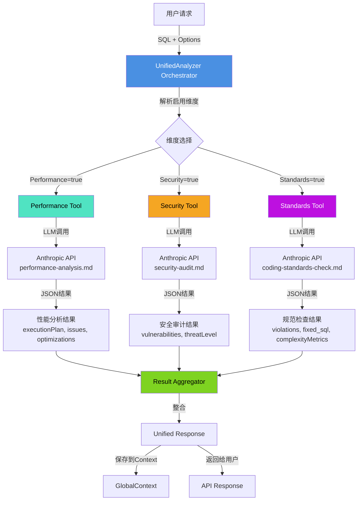

# UnifiedAnalyzer Multi-Agent架构重构方案

## 目录
1. [问题分析](#问题分析)
2. [架构设计原则](#架构设计原则)
3. [主控Agent设计](#主控agent设计)
4. [Sub-Agent工具定义](#sub-agent工具定义)
5. [数据流架构](#数据流架构)
6. [实施方案](#实施方案)
7. [关键代码示例](#关键代码示例)

---

## 问题分析

### 当前架构的核心问题

**问题根源：错误的提示词合并策略**

```javascript
// 当前的错误实现 (unified-analyzer.js:483-488)
if (prompts.length > 1) {
  const combinedSystemPrompt = prompts.map(p => p.content).join('\n\n');
  return [
    { role: 'system', content: combinedSystemPrompt },
    { role: 'user', content: userPrompt }
  ];
}
```

**导致的问题：**
1. ❌ **系统提示损坏**：三个复杂提示词（每个3000+字符）被简单拼接，导致系统提示只有4字符
2. ❌ **角色混淆**：LLM不知道自己应该是性能分析师、安全审计师还是规范检查器
3. ❌ **返回格式错误**：缺失`complexityMetrics`、`fixed_sql`、`vulnerabilities`等关键字段
4. ❌ **违背Single Responsibility Principle**：一次调用试图完成三个专业任务

### 根本设计缺陷

**当前架构假设（错误）：**
```
一次LLM调用 + 三个提示词 = 三维度分析结果
```

**实际情况：**
- LLM需要明确的角色定位才能给出专业分析
- 复杂提示词之间的语义会相互干扰
- JSON Schema定义冲突（performance、security、standards各自有不同的输出结构）

---

## 架构设计原则

### Agent-as-Tool模式

**核心理念：**
```
UnifiedAnalyzer = Orchestrator Agent
                + Performance Tool (专用LLM调用)
                + Security Tool (专用LLM调用)
                + Standards Tool (专用LLM调用)
```

**设计优势：**
1. ✅ **明确职责分离**：每个sub-agent使用完整的专用提示词
2. ✅ **独立LLM调用**：每个维度保持清晰的角色和JSON Schema
3. ✅ **并行执行能力**：三个工具调用可并行或串行
4. ✅ **灵活组合**：根据`options`动态启用维度

### 关键架构原则

**1. 主控Agent的角色：Orchestrator而非Analyzer**
```
主控Agent职责：
├── 解析用户需求（启用哪些维度）
├── 调度Sub-Agent工具（并行/串行策略）
├── 整合分析结果
└── 统一错误处理
```

**2. Sub-Agent工具化：Function Calling模式**
```javascript
// 每个Sub-Agent作为Tool Function
const performanceAnalysisTool = {
  name: "analyze_performance",
  description: "分析SQL性能瓶颈",
  parameters: { sql, databaseType },
  execute: async (params) => {
    // 使用performance-analysis.md提示词
    // 返回标准化JSON结果
  }
}
```

**3. 数据流清晰性**
```
Input (SQL + Options)
  ↓
Orchestrator决策
  ↓ (并行)
┌─────────┬──────────┬─────────┐
│Perf Tool│Sec Tool  │Std Tool │
└─────────┴──────────┴─────────┘
  ↓
Result Aggregation
  ↓
Unified Response
```

---

## 主控Agent设计

### 系统提示词设计

**主控Agent角色定位：**
```markdown
您是SQL语句智能规则分析与扫描工具的协调器（Orchestrator）。

## 您的职责

1. **任务分解**：根据用户启用的分析维度，决定调用哪些专用分析工具
2. **工具调度**：调用性能分析、安全审计、编码规范检查工具
3. **结果整合**：汇总各工具的分析结果，形成统一报告
4. **质量保证**：确保所有结果符合预期的JSON格式

## 可用工具

### 1. analyze_performance
- **用途**：深度SQL性能分析
- **输入**：{ sql: string, databaseType: string }
- **输出**：性能评分、执行计划、优化建议

### 2. analyze_security
- **用途**：安全漏洞审计
- **输入**：{ sql: string, databaseType: string }
- **输出**：安全评分、漏洞列表、修复建议

### 3. analyze_standards
- **用途**：编码规范检查
- **输入**：{ sql: string, databaseType: string }
- **输出**：规范评分、违规列表、修正SQL

## 工作流程

1. 检查用户启用的维度（performance/security/standards）
2. 并行调用对应的分析工具
3. 等待所有工具返回结果
4. 整合为统一的JSON格式：
   {
     "performance": {...} | null,
     "security": {...} | null,
     "standards": {...} | null,
     "metadata": {...}
   }

## 重要约束

- 不要尝试自己进行分析，而是调用专用工具
- 保持各维度结果的独立性，不要合并或修改
- 如果某个维度未启用，返回null而非空对象
```

### 工具调度策略

**选项1：并行执行（推荐）**
```javascript
async orchestrate(context) {
  const { performance, security, standards } = enabledDimensions;
  
  // 并行调用
  const [perfResult, secResult, stdResult] = await Promise.all([
    performance ? this.tools.analyze_performance(context) : null,
    security ? this.tools.analyze_security(context) : null,
    standards ? this.tools.analyze_standards(context) : null
  ]);
  
  return this.aggregateResults(perfResult, secResult, stdResult);
}
```

**选项2：串行执行（简单但慢）**
```javascript
async orchestrate(context) {
  const results = {};
  
  if (enabledDimensions.performance) {
    results.performance = await this.tools.analyze_performance(context);
  }
  // ... 依次执行
  
  return results;
}
```

---

## Sub-Agent工具定义

### Tool Schema设计

**1. Performance Analysis Tool**
```javascript
{
  name: "analyze_performance",
  description: "对SQL语句进行深度性能分析，识别瓶颈并提供优化建议",
  
  parameters: {
    type: "object",
    properties: {
      sql: {
        type: "string",
        description: "待分析的SQL语句"
      },
      databaseType: {
        type: "string",
        enum: ["mysql", "postgresql", "oracle", "sqlserver", "clickhouse", "sqlite"],
        description: "数据库类型"
      }
    },
    required: ["sql", "databaseType"]
  },
  
  // 使用完整的performance-analysis.md提示词
  systemPrompt: loadPrompt('performance-analysis.md'),
  
  // 返回值JSON Schema
  returns: {
    type: "object",
    properties: {
      score: { type: "number", min: 0, max: 100 },
      confidence: { type: "number", min: 0, max: 1 },
      executionPlan: { type: "object" },
      issues: { type: "array" },
      optimizations: { type: "array" },
      metrics: { type: "object" },
      recommendations: { type: "array" }
    }
  }
}
```

**2. Security Audit Tool**
```javascript
{
  name: "analyze_security",
  description: "对SQL语句进行安全审计，识别漏洞和安全风险",
  
  parameters: {
    type: "object",
    properties: {
      sql: { type: "string" },
      databaseType: { type: "string" }
    },
    required: ["sql", "databaseType"]
  },
  
  systemPrompt: loadPrompt('security-audit.md'),
  
  returns: {
    type: "object",
    properties: {
      score: { type: "number" },
      confidence: { type: "number" },
      threatLevel: { type: "string" },
      attackSurface: { type: "object" },
      vulnerabilities: { type: "array" },
      recommendations: { type: "array" },
      securityMetrics: { type: "object" },
      complianceAssessment: { type: "object" },
      bestPractices: { type: "array" }
    }
  }
}
```

**3. Standards Check Tool**
```javascript
{
  name: "analyze_standards",
  description: "检查SQL编码规范，提供格式化建议和修正SQL",
  
  parameters: {
    type: "object",
    properties: {
      sql: { type: "string" },
      databaseType: { type: "string" }
    },
    required: ["sql", "databaseType"]
  },
  
  systemPrompt: loadPrompt('coding-standards-check.md'),
  
  returns: {
    type: "object",
    properties: {
      score: { type: "number" },
      confidence: { type: "number" },
      qualityLevel: { type: "string" },
      standardsCompliance: { type: "object" },
      complexityMetrics: { type: "object" },
      violations: { type: "array" },
      fixed_sql: { type: "string" },
      fixSummary: { type: "object" },
      recommendations: { type: "array" },
      qualityMetrics: { type: "object" },
      bestPractices: { type: "array" }
    }
  }
}
```

### 工具实现模式

```javascript
class AnalysisTool {
  constructor(name, promptFile, schema) {
    this.name = name;
    this.promptFile = promptFile;
    this.schema = schema;
  }
  
  async execute(params) {
    // 1. 加载专用提示词
    const promptResult = await buildPrompt(this.promptFile, {
      DatabaseType: params.databaseType,
      dialect: params.databaseType
    }, { category: 'analyzers' });
    
    // 2. 构建消息
    const messages = [
      { role: 'system', content: promptResult.systemPrompt },
      { role: 'user', content: `请分析以下SQL:\n${params.sql}` }
    ];
    
    // 3. 调用LLM
    const response = await this.invokeLLM(messages, {
      temperature: 0.1,
      maxTokens: 4000
    });
    
    // 4. 解析并验证
    const result = this.parseAndValidate(response, this.schema);
    
    return result;
  }
  
  parseAndValidate(response, schema) {
    // 使用structured-parser.js解析
    // 验证是否符合schema
    // 返回标准化结果
  }
}

---

## 数据流架构

### 架构图



### 执行流程详解

**阶段1：请求解析**
```javascript
// 输入
{
  sql: "SELECT * FROM users WHERE id = ?",
  databaseType: "mysql",
  options: {
    performance: true,
    security: true,
    standards: false
  }
}

// Orchestrator决策
enabledTools = ["analyze_performance", "analyze_security"]
```

**阶段2：并行工具调用**
```javascript
// Performance Tool调用
PerformanceTool.execute({
  sql: "...",
  databaseType: "mysql"
}) 
// → 使用完整的performance-analysis.md提示词
// → 返回: { score, executionPlan, issues, optimizations, ... }

// Security Tool调用
SecurityTool.execute({
  sql: "...",
  databaseType: "mysql"
})
// → 使用完整的security-audit.md提示词
// → 返回: { score, vulnerabilities, threatLevel, ... }
```

**阶段3：结果整合**
```javascript
{
  success: true,
  analyzer: "unified",
  data: {
    performance: { score: 75, issues: [...], optimizations: [...] },
    security: { score: 90, vulnerabilities: [...] },
    standards: null // 未启用
  },
  metadata: {
    duration: 3500,
    llmCalls: 2, // performance + security
    confidence: 0.85
  }
}
```

---

## 实施方案

### 文件修改清单

**1. 核心文件重构**
- [`src/core/analyzers/unified-analyzer.js`](../src/core/analyzers/unified-analyzer.js) - **完全重写**

**2. 新增文件**
- `src/core/analyzers/tools/performance-tool.js` - 性能分析工具
- `src/core/analyzers/tools/security-tool.js` - 安全审计工具
- `src/core/analyzers/tools/standards-tool.js` - 规范检查工具
- `src/core/analyzers/tools/base-tool.js` - 工具基类

**3. 保持不变**
- `src/prompts/analyzers/*.md` - 所有提示词文件保持原样
- `src/core/analyzers/base-analyzer.js` - 基类保持不变

### 实施步骤

**Phase 1: 创建工具基础设施 (2-3小时)**

1. **创建BaseTool抽象类**
```javascript
// src/core/analyzers/tools/base-tool.js
export class BaseTool {
  constructor(name, promptFile, schema) {
    this.name = name;
    this.promptFile = promptFile;
    this.schema = schema;
  }
  
  async execute(params) {
    // 标准化的工具执行流程
  }
  
  async loadPrompt(params) {
    // 加载专用提示词
  }
  
  async invokeLLM(messages, options) {
    // LLM调用逻辑
  }
  
  parseAndValidate(response) {
    // 结果解析和验证
  }
}
```

2. **实现三个Sub-Agent工具**
- `PerformanceTool extends BaseTool`
- `SecurityTool extends BaseTool`
- `StandardsTool extends BaseTool`

**Phase 2: 重写UnifiedAnalyzer (3-4小时)**

1. **移除错误的提示词合并逻辑**
   - 删除`buildDetailedPrompt`方法 (L433-L501)
   - 删除所有提示词拼接代码

2. **实现Orchestrator模式**
```javascript
class UnifiedAnalyzer extends BaseAnalyzer {
  constructor(config) {
    super(config);
    
    // 初始化工具
    this.tools = {
      performance: new PerformanceTool(),
      security: new SecurityTool(),
      standards: new StandardsTool()
    };
  }
  
  async analyze(context) {
    // 1. 解析启用的维度
    const enabledDimensions = this.getEnabledDimensions(context.options);
    
    // 2. 并行调用工具
    const results = await this.executeTools(context, enabledDimensions);
    
    // 3. 整合结果
    return this.aggregateResults(results, context);
  }
  
  async executeTools(context, enabledDimensions) {
    const toolCalls = [];
    
    if (enabledDimensions.performance) {
      toolCalls.push(this.tools.performance.execute({
        sql: context.sql,
        databaseType: context.databaseType
      }));
    }
    
    // ... 其他工具
    
    return Promise.all(toolCalls);
  }
}
```

**Phase 3: 测试和验证 (2-3小时)**

1. **单元测试**
   - 测试每个Tool独立执行
   - 验证返回的JSON结构完整性

2. **集成测试**
   - 测试单维度分析
   - 测试多维度并行分析
   - 测试错误处理

3. **回归测试**
   - 确保API兼容性
   - 验证所有字段都正确返回

**Phase 4: 性能优化 (1-2小时)**

1. **实现智能缓存**
```javascript
// 如果同一SQL在短时间内多次分析，复用结果
const cacheKey = `${sql}-${databaseType}-${dimensionHash}`;
if (cache.has(cacheKey)) {
  return cache.get(cacheKey);
}
```

2. **动态并行度调整**
```javascript
// 根据服务器负载决定并行还是串行
if (serverLoad > 0.8) {
  // 串行执行减轻压力
} else {
  // 并行执行提升速度
}
```

### 实施优先级

| 优先级 | 任务 | 工作量 | 价值 |
|--------|------|--------|------|
| P0 | 创建BaseTool和三个Tool实现 | 3h | 架构基础 |
| P0 | 重写UnifiedAnalyzer为Orchestrator | 3h | 核心功能 |
| P1 | 编写单元测试 | 2h | 质量保证 |
| P1 | 修复字段缺失问题 | 1h | Bug修复 |
| P2 | 性能优化（并行执行） | 2h | 性能提升 |
| P3 | 缓存机制 | 1h | 性能提升 |

---

## 关键代码示例

### 示例1：BaseTool实现

```javascript
// src/core/analyzers/tools/base-tool.js

import { buildPrompt } from '../../../utils/format/prompt-loader.js';
import { parseStructuredResponse } from '../../../utils/parsing/structured-parser.js';
import logger from '../../../utils/logger.js';

export class BaseTool {
  constructor(config) {
    this.name = config.name;
    this.promptFile = config.promptFile;
    this.schema = config.schema;
    this.category = config.category || 'analyzers';
  }

  /**
   * 执行工具分析
   * @param {Object} params - { sql, databaseType }
   * @returns {Promise<Object>} 分析结果
   */
  async execute(params) {
    try {
      // 1. 加载专用提示词
      const prompt = await this.loadPrompt(params);
      
      // 2. 构建消息
      const messages = this.buildMessages(prompt, params);
      
      // 3. 调用LLM
      const response = await this.invokeLLM(messages);
      
      // 4. 解析和验证
      const result = this.parseAndValidate(response);
      
      return {
        success: true,
        data: result,
        metadata: {
          tool: this.name,
          confidence: result.confidence || 0.5
        }
      };
    } catch (error) {
      logger.error(`[${this.name}] 执行失败:`, error);
      return {
        success: false,
        error: error.message,
        data: this.getDefaultResult()
      };
    }
  }

  /**
   * 加载提示词
   */
  async loadPrompt(params) {
    const promptResult = await buildPrompt(
      this.promptFile,
      {
        DatabaseType: params.databaseType || '未知',
        dialect: params.databaseType || 'generic'
      },
      { category: this.category }
    );
    
    return promptResult.systemPrompt;
  }

  /**
   * 构建消息数组
   */
  buildMessages(systemPrompt, params) {
    return [
      {
        role: 'system',
        content: systemPrompt
      },
      {
        role: 'user',
        content: `请分析以下SQL语句：\n\n数据库类型: ${params.databaseType}\n\nSQL:\n\`\`\`sql\n${params.sql}\n\`\`\``
      }
    ];
  }

  /**
   * 调用LLM（需要子类实现具体的API调用）
   */
  async invokeLLM(messages) {
    // 这里需要访问BaseAnalyzer的LLM调用逻辑
    // 可以通过依赖注入或继承实现
    throw new Error('子类必须实现invokeLLM方法');
  }

  /**
   * 解析和验证响应
   */
  parseAndValidate(response) {
    return parseStructuredResponse(response, this.schema);
  }

  /**
   * 获取默认结果（错误时使用）
   */
  getDefaultResult() {
    return {
      score: 50,
      confidence: 0,
      issues: [],
      recommendations: []
    };
  }
}
```

### 示例2：PerformanceTool实现

```javascript
// src/core/analyzers/tools/performance-tool.js

import { BaseTool } from './base-tool.js';

export class PerformanceTool extends BaseTool {
  constructor(llmInvoker) {
    super({
      name: 'analyze_performance',
      promptFile: 'performance-analysis.md',
      schema: {
        type: 'object',
        required: ['score', 'confidence', 'executionPlan', 'issues', 'optimizations', 'metrics', 'recommendations'],
        properties: {
          score: { type: 'number', minimum: 0, maximum: 100 },
          confidence: { type: 'number', minimum: 0, maximum: 1 },
          executionPlan: { type: 'object' },
          issues: { type: 'array' },
          optimizations: { type: 'array' },
          metrics: { type: 'object' },
          recommendations: { type: 'array' }
        }
      }
    });
    
    this.llmInvoker = llmInvoker; // 注入LLM调用器
  }

  async invokeLLM(messages) {
    return this.llmInvoker(messages, {
      temperature: 0.1,
      maxTokens: 4000
    });
  }

  getDefaultResult() {
    return {
      score: 50,
      confidence: 0,
      executionPlan: {
        estimatedCost: 0,
        estimatedRows: 0,
        operations: []
      },
      issues: [],
      optimizations: [],
      metrics: {
        estimatedExecutionTime: 'unknown',
        ioOperations: 0,
        memoryUsage: 'unknown',
        cpuComplexity: 'Medium',
        parallelismPotential: 'Low'
      },
      recommendations: []
    };
  }
}
```

### 示例3：重构后的UnifiedAnalyzer

```javascript
// src/core/analyzers/unified-analyzer.js (核心部分)

import BaseAnalyzer from './base-analyzer.js';
import { PerformanceTool } from './tools/performance-tool.js';
import { SecurityTool } from './tools/security-tool.js';
import { StandardsTool } from './tools/standards-tool.js';

class UnifiedAnalyzer extends BaseAnalyzer {
  constructor(config = {}) {
    super(config);
    
    // 创建LLM调用器（绑定到BaseAnalyzer的方法）
    const llmInvoker = this.invokeLLMAndParse.bind(this);
    
    // 初始化工具
    this.tools = {
      performance: new PerformanceTool(llmInvoker),
      security: new SecurityTool(llmInvoker),
      standards: new StandardsTool(llmInvoker)
    };
  }

  getAnalyzerType() {
    return 'unified';
  }

  /**
   * 执行统一分析 - 使用Orchestrator模式
   */
  async analyze(context) {
    const startTime = Date.now();
    
    this.setGlobalContext(context);
    
    if (!this.initialized) {
      await this.initialize(context);
    }

    try {
      // 1. 解析启用的维度
      const enabledDimensions = this.getEnabledDimensions(context.options);
      
      if (!Object.values(enabledDimensions).some(Boolean)) {
        return this.createErrorResponse('未启用任何分析维度');
      }

      // 2. 并行执行工具
      const results = await this.executeToolsInParallel(context, enabledDimensions);
      
      // 3. 整合结果
      const analysisResults = this.aggregateResults(results, enabledDimensions);
      
      // 4. 构建响应
      const response = {
        success: true,
        analyzer: 'unified',
        data: analysisResults,
        metadata: {
          duration: Date.now() - startTime,
          llmCalls: results.filter(r => r.success).length,
          confidence: this.calculateAverageConfidence(results),
          databaseType: context.databaseType || 'unknown',
          enabledDimensions
        },
        timestamp: new Date().toISOString()
      };

      // 5. 保存结果到上下文
      this.saveResultsToContext(context, analysisResults, response);

      return response;
    } catch (error) {
      context.addError(this.getAnalyzerType(), error);
      return this.createErrorResponse(error.message);
    }
  }

  /**
   * 并行执行工具
   */
  async executeToolsInParallel(context, enabledDimensions) {
    const toolPromises = [];
    const toolNames = [];

    if (enabledDimensions.performance) {
      toolPromises.push(this.tools.performance.execute({
        sql: context.sql,
        databaseType: context.databaseType
      }));
      toolNames.push('performance');
    }

    if (enabledDimensions.security) {
      toolPromises.push(this.tools.security.execute({
        sql: context.sql,
        databaseType: context.databaseType
      }));
      toolNames.push('security');
    }

    if (enabledDimensions.standards) {
      toolPromises.push(this.tools.standards.execute({
        sql: context.sql,
        databaseType: context.databaseType
      }));
      toolNames.push('standards');
    }

    // 并行执行所有工具
    const results = await Promise.all(toolPromises);

    // 映射结果到维度名称
    return results.map((result, index) => ({
      dimension: toolNames[index],
      ...result
    }));
  }

  /**
   * 整合工具结果
   */
  aggregateResults(results, enabledDimensions) {
    const aggregated = {
      performance: null,
      security: null,
      standards: null
    };

    results.forEach(result => {
      if (result.success && result.data) {
        aggregated[result.dimension] = result.data;
      } else if (enabledDimensions[result.dimension]) {
        // 如果工具执行失败，使用默认结果
        aggregated[result.dimension] = this.tools[result.dimension].getDefaultResult();
      }
    });

    return aggregated;
  }

  /**
   * 计算平均置信度
   */
  calculateAverageConfidence(results) {
    const successfulResults = results.filter(r => r.success && r.data?.confidence);
    if (successfulResults.length === 0) return 0;
    
    const totalConfidence = successfulResults.reduce((sum, r) => sum + r.data.confidence, 0);
    return totalConfidence / successfulResults.length;
  }

  /**
   * 创建错误响应
   */
  createErrorResponse(message) {
    return {
      success: false,
      analyzer: 'unified',
      error: message,
      data: null,
      timestamp: new Date().toISOString()
    };
  }

  /**
   * 保存结果到上下文
   */
  saveResultsToContext(context, analysisResults, response) {
    Object.keys(analysisResults).forEach(dimension => {
      if (analysisResults[dimension] !== null) {
        context.setAnalysisResult(dimension, {
          success: true,
          analyzer: dimension,
          data: analysisResults[dimension],
          metadata: response.metadata,
          timestamp: response.timestamp
        });
      }
    });
  }
}

export default UnifiedAnalyzer;
```

---

## 总结

### 架构优势

1. **✅ 解决核心问题**：彻底修复提示词合并导致的系统提示损坏
2. **✅ 保持专业性**：每个维度使用完整的专用提示词，确保分析质量
3. **✅ 提升性能**：并行执行工具，减少总体响应时间
4. **✅ 增强可维护性**：清晰的职责分离，便于独立测试和优化
5. **✅ 保证兼容性**：API接口保持不变，对调用方透明

### 预期效果

**修复前的问题：**
- 系统提示只有4字符 ❌
- 缺失关键字段 ❌
- LLM返回错误JSON ❌

**修复后的效果：**
- 每个工具使用完整提示词 ✅
- 返回所有预期字段 ✅
- JSON格式正确完整 ✅
- 支持并行执行提升性能 ✅

### 风险评估

**低风险：**
- 提示词文件保持不变
- API接口保持兼容
- 渐进式重构，可分阶段实施

**需要注意：**
- LLM调用次数增加（成本考虑）
- 并行执行的错误处理复杂性
- 缓存策略的实施优先级

这个架构重构方案将彻底解决当前UnifiedAnalyzer的核心问题，同时为未来的扩展和优化奠定坚实基础。